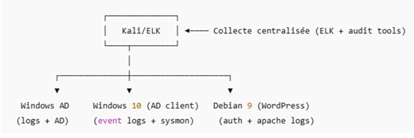

# I Audit de sécurité : Infrastructure Active Directory et WordPress

## I.1.1 Contexte du projet

Dans le cadre d’un exercice d’audit de sécurité, une infrastructure simulant le système d’information de l’entreprise fictive ICMAC a été conçue et déployée.

L’objectif est de reproduire un environnement d’entreprise réaliste comprenant :
- un domaine Active Directory ;
- un poste client Windows intégré au domaine ;
- un serveur web WordPress exposé sur un système Linux;

Cette infrastructure sert de support à un audit de sécurité réalisé dans un cadre strictement pédagogique et légal.

## I.1.2 Objectifs de l’audit

Les objectifs de cette mission sont les suivants :
- concevoir une infrastructure d’entreprise fonctionnelle ;
- mettre en place un environnement volontairement vulnérable ;
- auditer des systèmes Windows et Linux ;
- identifier :
    - les vulnérabilités techniques ;
    - les mauvaises pratiques de configuration ;
    - les risques de sécurité associés ;
- proposer des recommandations et mesures de remédiation ;
- produire un rapport d’audit structuré et exploitable.

L’audit vise à évaluer la robustesse des mécanismes d’authentification, la gestion des privilèges, la segmentation réseau, ainsi que les capacités de détection et de réponse aux incidents.

Le scénario d’attaque retenu considère un attaquant interne disposant d’un accès réseau local et d’un compte utilisateur standard compromis.

## I.1.3 Périmètre de l’audit

**Systèmes audités**

| Composant                 | Description                           |
| ------------------------- | ------------------------------------- |
| **Contrôleur de domaine** | Windows Server 2019                   |
| **Poste client**          | Windows 10                            |
| **Serveur Web**           | Debian 12                             |
| **Application Web**       | WordPress 5.5                         |
| **Services**              | AD DS, DNS, SMB, Apache, PHP, MariaDB |

**Éléments exclus du périmètre**

Les éléments suivants ne sont pas inclus dans le périmètre de l’audit :
- la sécurité physique ;
- les sauvegardes externes ;
- les postes utilisateurs hors domaine

## I.1.4 Mise en place de l’infrastructure

Cette section décrit la mise en place de l’infrastructure servant de support à l’audit de sécurité.

Certains paramètres ont été volontairement configurés de manière non sécurisée afin de :
- reproduire des situations réalistes rencontrées en entreprise ;
- permettre l’exploitation de vulnérabilités à des fins pédagogiques ;
- illustrer concrètement les impacts d’une mauvaise configuration.

Certains choix d’architecture et de configuration ont été volontairement effectués afin d’illustrer des scénarios d’attaque courants sur Active Directory, notamment en matière de gestion des identités, de protocoles d’authentification et de segmentation réseau.

## I.1.5 Vue d’ensemble de l’architecture

L’infrastructure mise en place repose sur une architecture simple, représentative d’un système d’information d’entreprise de petite à moyenne taille.

Elle est composée :
- d’un réseau interne hébergeant le domaine Active Directory ;
- d’un poste client Windows intégré au domaine ;
- d’un serveur Linux hébergeant une application WordPress exposée en HTTP.

Le contrôleur de domaine assure les services d’authentification, de résolution DNS et de gestion centralisée des identités.  
Le poste client constitue le point d’entrée initial du scénario d’attaque et représente la surface de compromission la plus exposée.  
Le serveur WordPress, bien que non joint au domaine, illustre une exposition applicative pouvant interagir indirectement avec l’environnement interne.

Cette architecture permet de démontrer une chaîne d’attaque réaliste, depuis un accès utilisateur initial jusqu’à une compromission étendue du système d’information.

## I.1.6 Structure du projet

### I.1.7 Description du schéma d’architecture

Le schéma ci-dessus présente l’architecture logique de l’infrastructure auditée.

Le contrôleur de domaine Active Directory (Windows Server 2019) est situé sur le réseau interne et fournit les services AD DS, DNS, Kerberos et SMB. 

Le poste client Windows 10 est joint au domaine et communique régulièrement avec le contrôleur pour l’authentification, l’accès aux partages réseau et l’application des stratégies de groupe.

Le serveur Debian hébergeant WordPress est accessible via le protocole HTTP et représente une surface d’exposition applicative. Bien qu’il ne soit pas membre du domaine, il est positionné sur le même segment réseau, ce qui permet d’illustrer des risques liés à une segmentation insuffisante entre les composants internes et exposés.

Une infrastructure de journalisation centralisée basée sur la stack ELK (Elasticsearch, Logstash, Kibana) a également été déployée.  
Elle permet la collecte et la corrélation des journaux provenant du contrôleur de domaine, du poste client et du serveur Linux, afin d’analyser les événements de sécurité, les tentatives d’authentification et les actions post-compromission.

Par ailleurs, une solution de scan de vulnérabilités automatisé OpenVAS / GVM est utilisé pour identifier les faiblesses de configuration et les vulnérabilités connues sur les systèmes audités, en complément des phases d’analyse manuelle.

Les flux principaux observés sont :
- authentification Kerberos et NTLM entre les postes et le contrôleur de domaine ;
- accès SMB aux partages réseau ;
- accès HTTP vers l’application WordPress ;
- remontée des journaux vers la plateforme ELK ;
- scans réseau et applicatifs réalisés par OpenVAS.

Cette architecture volontairement peu segmentée permet d’illustrer l’impact d’une compromission interne, la facilité de propagation des attaques et l’importance des mécanismes de détection et de supervision en l’absence de mesures de cloisonnement.
