# I.2 Mise en place de l’environnement Active Directory audité

## I.2.1 Architecture et machines déployées

Cette section décrit la mise en place de l’environnement Active Directory servant de socle à l’audit.  
L’architecture repose sur un domaine unique, un contrôleur de domaine central et un poste client, configuration fréquemment rencontrée dans les environnements de petite à moyenne taille.

Les mots de passe des comptes de service ont été configurés avec une complexité insuffisante afin d’illustrer un scénario d’exploitation réaliste.

### I.2.2 Contrôleur de domaine : Windows Server

Un contrôleur de domaine Windows Server a été déployé afin de constituer le socle de l’infrastructure Active Directory auditée.

**Rôles installés :**

- Active Directory Domain Services (AD DS)
- DNS
La capture suivante illustre la création du domaine cyber.lan et la promotion du serveur en contrôleur de domaine.

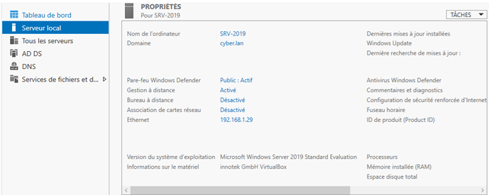    
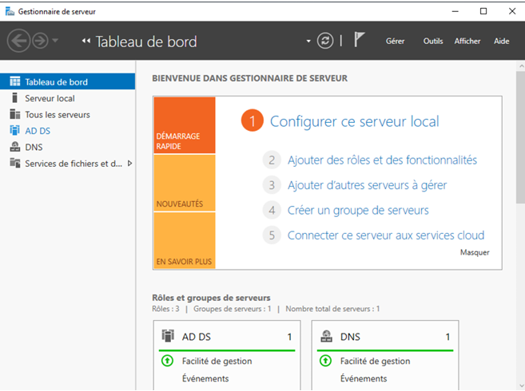

### I.2.3 Création du domaine

- Nom du domaine : cyber.lan


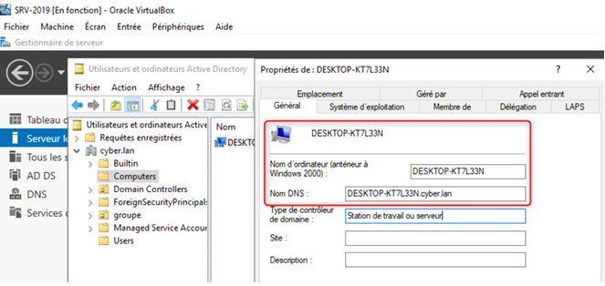

### I.2.4 Partages et administration

- Création de partages réseau
- Gestion des utilisateurs, groupes et stratégies de groupe (GPO)

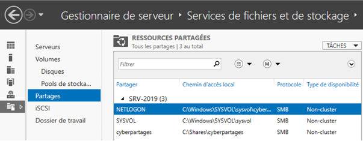

Certaines stratégies de groupe ont été volontairement configurées de manière non sécurisée afin d’illustrer l’impact direct de mauvaises pratiques de sécurité dans un environnement Active Directory.

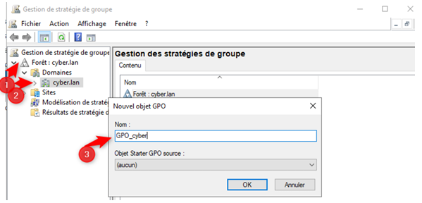 

Cette configuration illustre l’absence de contrôle et de revue des stratégies de groupe, problématique fréquente en l’absence de gouvernance Active Directory.
## I.2.4.1 Structuration de l’Active Directory (ADUC)

L’outil Active Directory Users and Computers (ADUC) a été utilisé afin de structurer l’annuaire Active Directory de manière réaliste.

**Objectifs**

- Organisation claire des objets AD
- Séparation utilisateurs / groupes / ordinateurs
- Préparation à l’application de GPO ciblées par OU
- Support à l’analyse des erreurs de configuration

**Actions réalisées**

1. Création d’unités organisationnelles (OU)
2. Réorganisation des groupes de sécurité
3. Création de comptes utilisateurs
    - Comptes administrateurs
    - Comptes utilisateurs standards

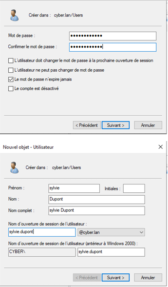

Cette structuration permet d’identifier plus facilement les faiblesses de gestion des identités analysées dans les sections suivantes.

## I.2.5 Comptes de service et SPN (Service Principal Name)

Dans un contexte réel, la compromission d’un compte de service peut permettre un accès persistant aux applications critiques et, dans certains cas, une escalade vers des privilèges élevés sur le domaine.

### I.2.5.1 Présentation des SPN

Les Service Principal Names (SPN) sont utilisés par Kerberos pour associer un service à un compte de sécurité dans Active Directory.

**Format général :**
```bash
Service/Serveur:Port
```
### I.2.5.2 Création volontaire d’un SPN vulnérable

Dans un objectif pédagogique et d’audit, un SPN a été configuré manuellement afin de simuler un service SQL exécuté sous un compte de service dédié.
```bash
setspn -a SRV-2019/sql.service.cyber.lan:60111 cyber\sql.services
```


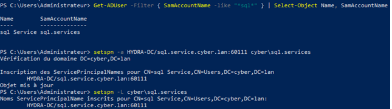

**vérification** 
```bash
setspn -L cyber\sql.services
```

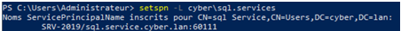

### I.2.5.3 Enjeux de sécurité

Une mauvaise gestion des SPN peut entraîner :
- des attaques de type Kerberoasting
- l’exposition de comptes de service
- une compromission du domaine en cas de mot de passe faible

Cette configuration a été volontairement mise en place afin de simuler un scénario exploitable fréquemment rencontré lors d’audits Active Directory.

## I.2.6 Stratégies de groupe volontairement non sécurisées

### I.2.6.1 Désactivation de Microsoft Defender Antivirus

Une GPO a été appliquée au niveau du domaine afin de désactiver Microsoft Defender Antivirus.

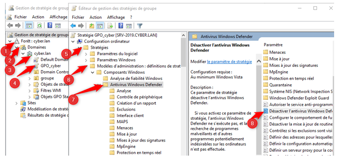

### I.2.6.2 Impact sécurité

- Suppression d’une protection native essentielle
- Exécution facilitée de charges malveillantes
- Simplification des phases de post‑exploitation
- Facilitation des mouvements latéraux

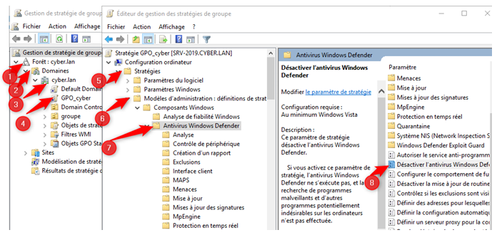

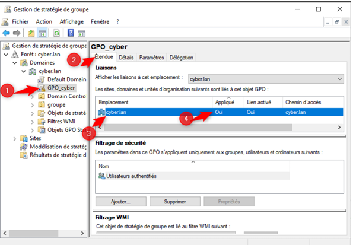

## I.2.7 Poste client : Windows 10

Un poste Windows 10 a été intégré au domaine cyber.lan afin de représenter un poste utilisateur standard.

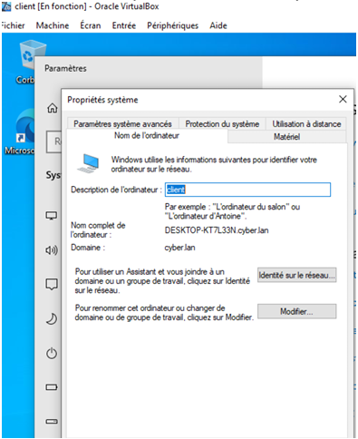

**Rôle dans l’audit**

Ce poste sert de :
- point d’entrée initial
- support à l’énumération AD
- base pour les attaques post‑exploitation
- vecteur de mouvement latéral

## I.2.8 Partages réseau et privilèges excessifs

### I.2.8.1 Partage réseau non sécurisé

Un partage réseau shares a été créé avec des permissions volontairement permissives.

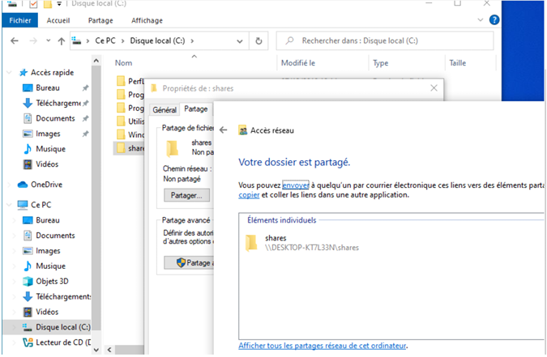

### I.2.8.2 Attribution de privilèges excessifs

Le compte Jules Ferry, membre des Administrateurs du domaine, a été ajouté comme administrateur local sur un poste client.

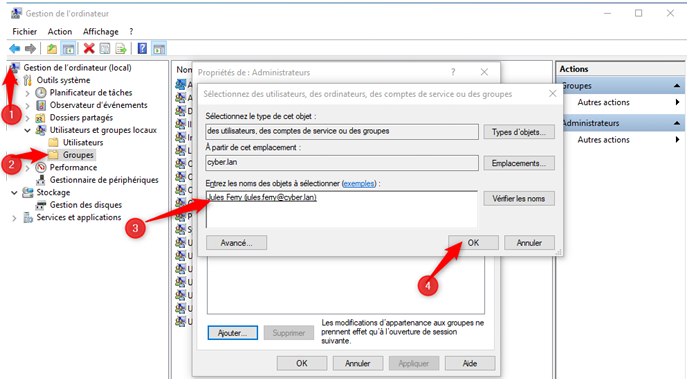  
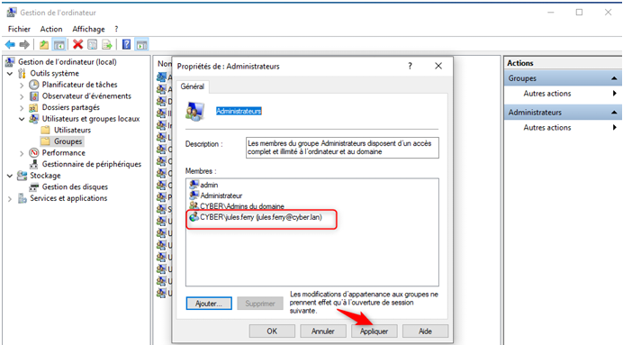

### I.2.8.3 Impact sécurité

Cette configuration augmente significativement la surface d’attaque et facilite la compromission du poste client.

Ces éléments constituent la base technique exploitée dans les phases d’énumération et de compromission décrites dans les sections suivantes.

Ces configurations facilitent des techniques telles que Kerberoasting, Pass-the-Hash et Lateral Movement (MITRE ATT&CK):
- Kerberoasting → T1558.003
- Pass-the-Hash → T1550.002
- Lateral Movement → T1021

## I.2.8.4 Résumé des faiblesses intentionnelles

**Synthèse des faiblesses identifiées**

| Élément     | Mauvaise configuration                             | Risque associé                                |
| ----------- | -------------------------------------------------- | --------------------------------------------- |
| SPN         | Compte de service faible                           | Kerberoasting                                 |
| GPO         | Defender désactivé                                 | Exécution malware                             |
| Partage SMB | Permissions larges                                 | Escalade                                      |
| Admin local | Compte Domain Admin ajouté en administrateur local | Mouvement latéral et compromission du domaine |
Ces faiblesses ont été volontairement introduites afin de reproduire des erreurs de configuration fréquemment observées lors d’audits Active Directory en environnement réel.
