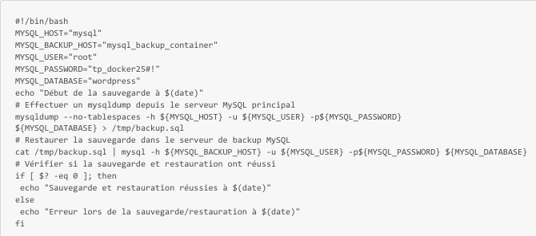
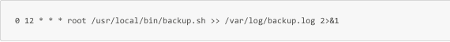
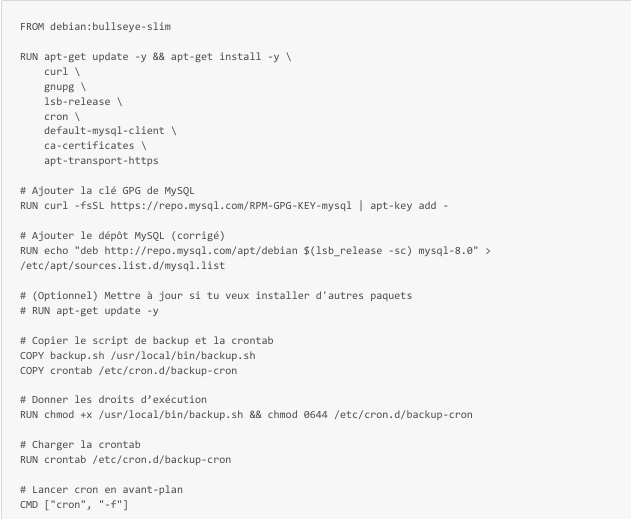
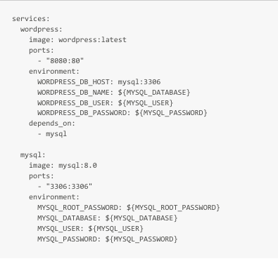
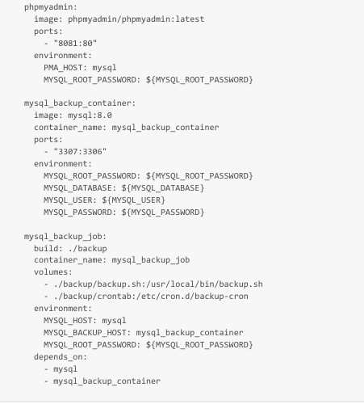
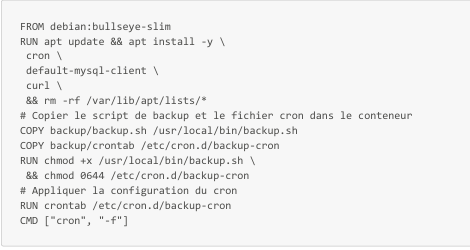
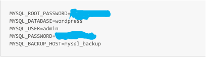
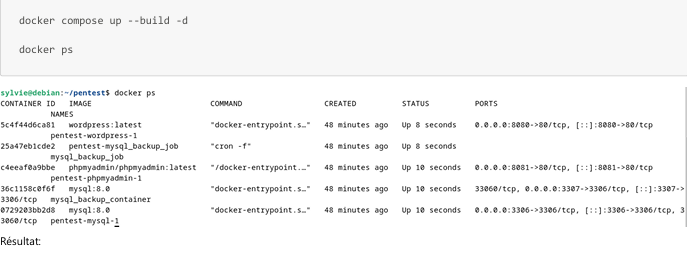
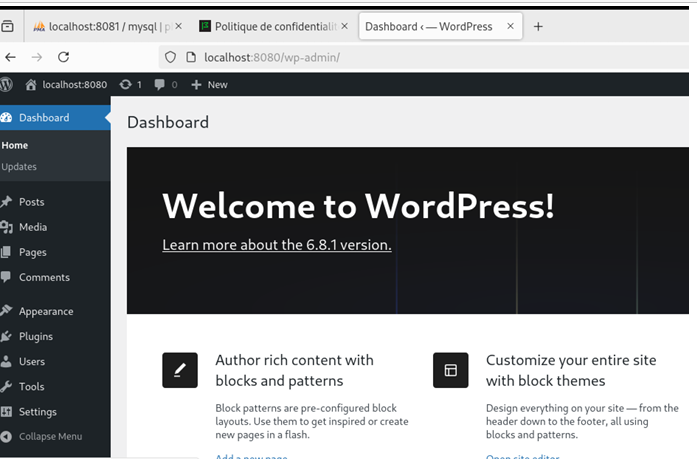
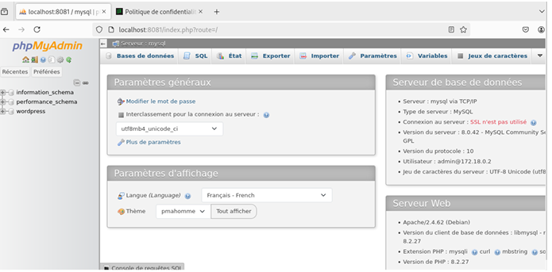

# I.3 Mise en place du serveur Debian et de l’application WordPress

Un serveur Debian a été déployé afin d’héberger une application WordPress 5.5

Cette machine représente un serveur web exposé, typiquement présent dans une infrastructure d’entreprise, et constitue une cible privilégiée lors d’audits applicatifs et systèmes.
## I.3.1 Configuration du serveur

Les actions suivantes ont été réalisées :
- Installation des services nécessaires au fonctionnement de l’application web :
    - Apache
    - PHP
    - MariaDB
- Installation de WordPress 5.5
- Configuration volontairement non sécurisée du serveur web :
    - absence de chiffrement TLS / HTTPS
    - accès à l’application uniquement via HTTP
Cette configuration permet également de démontrer l’interception de trafic et le vol de cookies lors d’attaques réseau internes.

## I.3.2 Impact sécurité

Les choix de configuration effectués introduisent plusieurs faiblesses de sécurité, notamment :
- Transmission des données en clair (identifiants, cookies, contenus)
- Vulnérabilité accrue aux attaques de type Man-in-the-Middle
- Exposition d’une version de WordPress obsolète présentant des vulnérabilités connues
- Absence de mécanismes de protection applicative de base

Cette configuration a été volontairement mise en place afin de reproduire des mauvaises pratiques pouvant être observées lors d’audits de serveurs web et d’applications WordPress.
## I.3.3 Mise en place de Docker et Docker Compose sur Debian 

Afin de faciliter le déploiement et de reproduire un environnement applicatif moderne et conteneurisé, Docker et Docker Compose ont été installés sur le serveur Debian.

L’utilisation de conteneurs permet de :
- déployer rapidement les services applicatifs
- isoler et exposer de manière contrôlée les ports et services
- analyser les risques liés aux environnements conteneurisés
### I.3.3.1 Installation de Docker Engine

1. Mise à jour du système et installation des dépendances nécessaires :
```bash
sudo apt update -y
sudo apt install -y apt-transport-https ca-certificates curl gnupg lsb-release
```

2. Ajout de la clé GPG officielle de Docker :
```bash
curl -fsSL https://download.docker.com/linux/debian/gpg | sudo gpg --dearmor -o /usr/share/keyrings/docker archive-keyring.gpg
```

3. Ajout du dépôt officiel Docker :
```bash
echo "deb [arch=amd64 signed-by=/usr/share/keyrings/docker-archive-keyring.gpg] \ https://download.docker.com/linux/debian $(lsb_release -cs) stable" | \ sudo tee /etc/apt/sources.list.d/docker.list > /dev/null
```
4. Installation de Docker :
```bash
sudo apt update sudo apt install -y docker-ce docker-ce-cli containerd.io
```
5. Vérification de l’installation :
```bash
sudo docker version
```
### I.3.3.2 Configuration des droits utilisateur Docker

Afin d’éviter l’utilisation systématique de sudo pour les commandes Docker, l’utilisateur courant a été ajouté au groupe docker :
```bash
sudo usermod -aG docker $USER
```
Après cette opération, une déconnexion/reconnexion (ou la commande suivante) est nécessaire :
```bash
newgrp docker
```
Cette configuration, bien que pratique, constitue une mauvaise pratique de sécurité car l’appartenance au groupe docker équivaut à des privilèges root sur le système.

### I.3.3.3 Installation de Docker Compose (plugin v2)

Depuis 2023, Docker Compose est intégré sous forme de plugin officiel.
```bash
sudo apt install -y docker-compose-plugin
```
docker compose version
```bash
docker compose version
```
## I.3.4 Objectifs de cette configuration dans le cadre de l’audit

Cette architecture conteneurisée a été mise en place pour simuler un environnement vulnérable et exploitable, et permettre l’analyse des risques suivants :
- mots de passe stockés en clair dans des fichiers .env
- exposition de services sensibles (MariaDB, phpMyAdmin)
- erreurs de configuration de l’application WordPress
- mauvaise gestion des conteneurs Docker (droits, isolation, volumes)
- absence de chiffrement des communications web (HTTP uniquement)

Ces éléments serviront de base à la phase d’audit de sécurité du serveur Debian et de l’application WordPress.
## I.3.5 Mécanismes de sauvegarde et orchestration applicative (Docker)

Dans le cadre de l’infrastructure WordPress déployée sur Debian, un mécanisme de sauvegarde MySQL et une orchestration via Docker Compose ont été mis en place.

Ces éléments sont volontairement configurés avec des mauvaises pratiques afin de permettre un audit pédagogique.



### I.3.5.1  Mécanisme de sauvegarde MySQL

Un mécanisme automatique de sauvegarde de la base de données MySQL a été configuré, comprenant :
- un dump régulier de la base principale
- une restauration automatique vers une base de secours
- un journal d’exécution pour suivre les opérations
### I.3.5.2 Observations de sécurité

- Les identifiants MySQL sont stockés en clair dans les scripts de sauvegarde (backup.sh)
- Les scripts sont exécutés depuis un conteneur avec des droits étendus
### I.3.5.3 Impact sécurité 

- Un accès non autorisé aux scripts ou aux conteneurs permet de récupérer les identifiants et d’accéder à l’ensemble de la base de données
- Cette configuration illustre les risques liés à la gestion non sécurisée des secrets dans un environnement conteneurisé
- Permet la démonstration d’attaques de type exfiltration de données lors de l’audit

**Script de sauvegarde (backup/backup.sh)**

Ce script effectue :
1. Un dump de la base MySQL principale
2. Une restauration automatique vers une base de secours
3. Un journal d’exécution





## I.3.6 Orchestration des services (docker-compose.yml)

L’ensemble de l’environnement applicatif a été déployé via Docker Compose, comprenant :
- WordPress (HTTP uniquement)
- Base de données MySQL principal
- Base de données MySQL de sauvegarde
- phpMyAdmin
- Conteneur dédié à la sauvegarde automatisée
#### Observations de sécurité

- Les services sont exposés sur des ports accessibles, ce qui permet de tester les vulnérabilités applicative
- Les volumes et conteneurs contiennent des informations sensibles (mots de passe en clair, données de la base)
- L’absence de chiffrement et l’exposition HTTP facilitent la démonstration de risques de type Man-in-the-Middle ou interception de données







**Objectifs pour l'audit**

Cette configuration a été mise en place pour :
- Illustrer les risques liés à la gestion des secrets et des mots de passe dans des scripts ou conteneurs
- Mettre en évidence l’impact d’une mauvaise orchestration des services sur la sécurité globale
- Permettre l’exploitation contrôlée de ces vulnérabilités lors de l’audit (accès à MySQL, mouvements latéraux, récupération de données)
## I.3.6 Gestion des secrets via le fichier .env



Dans l’environnement conteneurisé déployé sur le serveur Debian, les identifiants utilisés par les différents services Docker (WordPress, MySQL, phpMyAdmin) sont centralisés dans un fichier .env.

Ce choix de conception, bien que fonctionnel, constitue une mauvaise pratique de sécurité volontaire.

### I.3.6.1 Faiblesses de sécurité identifiées (volontaires)

- Stockage des secrets en clair dans un fichier accessible au système
- Absence de mécanisme de gestion sécurisée des secrets  
    _(Docker Secrets, HashiCorp Vault, variables d’environnement chiffrées, etc.)_
- Accès direct aux identifiants en cas de compromission :
    - du serveur Debian
    - d’un conteneur Docker
    - des volumes montés
### I.3.6.2 Déploiement de l’environnement applicatif

L’ensemble des conteneurs a été lancé à l’aide de Docker Compose, rendant accessibles les services suivants :
- WordPress via HTTP
- phpMyAdmin, exposé pour l’administration de la base de données

Ces accès confirment le bon fonctionnement de l’environnement tout en exposant volontairement des surfaces d’attaque exploitables.



**Résultat**

- WordPress accessible :  
     [http://localhost:8080](http://localhost:8080)
  


- phpMyAdmin accessible :  
     [http://localhost:8081](http://localhost:8081)
  


Ces éléments constituent la base technique exploitée lors de la phase d’audit de sécurité applicative et système présentée dans les sections suivantes.

### I.3.6.3 Impact sécurité global

Les configurations mises en place exposent plusieurs risques critiques :
- Compromission complète de la base de données MySQL
- Accès aux données applicatives sensibles :
    - comptes utilisateurs
    - mots de passe (hachés ou en clair selon les cas)
    - paramètres de configuration
- Modification ou suppression non autorisée des données
- Compromission potentielle de l’ensemble de l’application WordPress

Ces faiblesses ont été volontairement introduites afin d’être exploitées et analysées dans la phase d’audit de sécurité du serveur Debian et de l’application WordPress.

Ces configurations permettent d’illustrer des techniques telles que Credential Access, Exfiltration et Lateral Movement (MITRE ATT&CK).

### I.3.6.4 Synthèse des vulnérabilités

|Élément|Mauvaise pratique|Risque|
|---|---|---|
|HTTP uniquement|Pas de TLS|MITM|
|.env|Secrets en clair|Credential Access|
|Groupe docker|Privilège root implicite|Escalade|
|phpMyAdmin exposé|Surface admin|Compromission DB|
