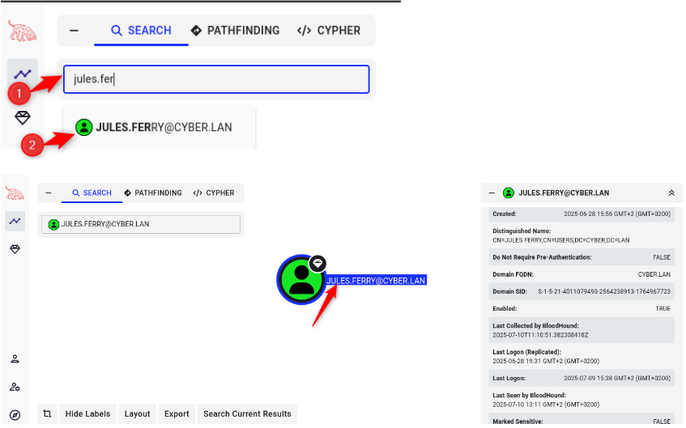
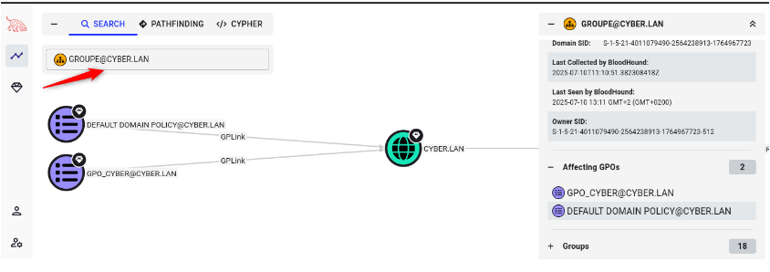
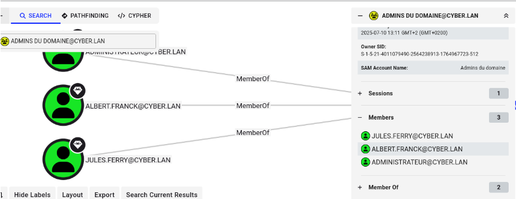
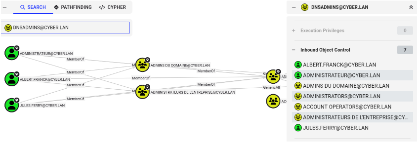
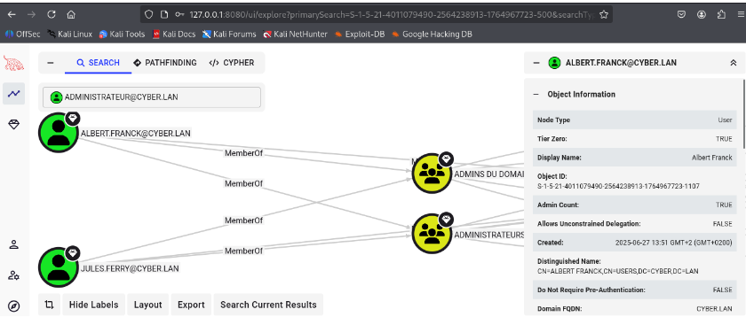

# II.3 Analyse Active Directory avec BloodHound

## Méthodologie

Les données Active Directory ont été collectées à l’aide de SharpHound depuis une machine du domaine, puis analysées via BloodHound CE afin d’identifier les relations de privilèges et les chemins d’escalade potentiels.
## II.3.1 Analyse des relations de privilèges Active Directory

L’analyse BloodHound a permis de cartographier les relations entre utilisateurs, groupes, ordinateurs et droits associés.

Cette analyse met notamment en évidence :
- les appartenances aux groupes à privilèges élevés ;
- les accès administrateur locaux étendus ;
- les chemins d’attaque indirects menant à des comptes Domain Admin.

Les requêtes et visualisations suivantes ont été utilisées afin d’identifier les relations à risque au sein de l’annuaire Active Directory :

- Recherche d’un utilisateur spécifique

- Analyse des appartenances aux groupes
  
  

- Identification des machines accessibles
- Tous les administrateurs du domaine

- Visualisation des chemins d’attaque vers Domain Admin

Ces relations constituent des vecteurs d’escalade souvent invisibles lors d’une énumération classique des comptes et des services.

L’analyse des relations de privilèges a permis d’identifier plusieurs chemins d’attaque critiques, dont l’un des plus impactants repose sur une mauvaise délégation au sein du groupe DNSAdmins.

### II.3.2 Vulnérabilité critique : Appartenance au groupe DNSAdmins

Le groupe DNSAdmins est un groupe privilégié d’Active Directory permettant l’administration du service DNS sur les contrôleurs de domaine.

Dans un environnement Active Directory standard, le service DNS est généralement exécuté sur un contrôleur de domaine, ce qui confère à ce groupe un niveau de privilèges particulièrement élevé.

### II.3.3 Risque de sécurité

Les membres du groupe DNSAdmins disposent de la capacité de :
- modifier la configuration du service DNS ;
- charger une DLL personnalisée via les paramètres du service ;
- influencer le comportement d’un service exécuté avec des privilèges SYSTEM.

Cette délégation constitue un vecteur d’escalade de privilèges critique.

### II.3.4 Scénario d’exploitation (escalade de privilèges)

Un attaquant ayant compromis un compte membre de DNSAdmins peut :
1. Modifier la configuration du service DNS afin d’y injecter une DLL malveillante
2. Forcer ou attendre le redémarrage du service DNS
3. Obtenir une exécution de code avec des privilèges SYSTEM sur le contrôleur de domaine
4. Extraire des secrets sensibles (hashs NTLM, tickets Kerberos)
5. Escalader ses privilèges jusqu’au niveau Domain Admin

### II.3.5 Détection via BloodHound

BloodHound met en évidence ce scénario en identifiant les relations suivantes :
- un utilisateur membre du groupe DNSAdmins ;
- le contrôle du service DNS par ce groupe ;
- l’exécution du service DNS avec des privilèges SYSTEM.

Ces relations forment un chemin d’attaque direct vers Domain Admin.

### II.3.6 Niveau de criticité

| Élément                   | Évaluation                        |
| ------------------------- | --------------------------------- |
| Type de vulnérabilité     | Mauvaise délégation de privilèges |
| Complexité d’exploitation | Faible                            |
| Privilèges requis         | Compte utilisateur authentifié    |
| Impact                    | Compromission totale du domaine   |
| Niveau de risque          | risque maximal.                   |

### II.3.7 Recommandations

- Restreindre strictement l’appartenance au groupe DNSAdmins
- Ne jamais inclure de comptes utilisateurs standards
- Auditer régulièrement les groupes à privilèges élevés
- Surveiller toute modification de la configuration du service DNS
- Appliquer le principe du moindre privilège

### II.3.8 Chargement de DLL et impact sécurité

Les membres du groupe DNSAdmins peuvent configurer le service DNS pour charger une DLL arbitraire.  
Sur un contrôleur de domaine, ce mécanisme permet l’exécution de code avec des privilèges SYSTEM, constituant un vecteur d’escalade de privilèges critique.

### II.3.9 Scénario d’attaque simplifié

1. Compromission d’un compte membre de DNSAdmins  
2. Configuration du service DNS pour charger une DLL malveillante  
3. Redémarrage du service DNS  
4. Exécution de code à haut privilège sur le contrôleur de domaine  

### II.3.10 Impact sécurité global

L’analyse BloodHound met en évidence :
- des délégations de privilèges excessives ;
- des chemins d’attaque multi-étapes ;
- la possibilité pour un attaquant disposant d’un simple compte utilisateur d’atteindre un compte Domain Admin.
Ce scénario correspond à plusieurs tactiques du framework MITRE ATT&CK, notamment Privilege Escalation, Credential Access et Lateral Movement, menant à une compromission complète du domaine.

### II.3.11 Conclusion de la section

L’utilisation de BloodHound révèle des faiblesses structurelles dans l’Active Directory, souvent invisibles sans une analyse orientée graphe.

Cette analyse démontre que des comptes non administrateurs peuvent, par simple héritage de droits mal délégués, atteindre un niveau Domain Admin.  
Ce type de vulnérabilité constitue un risque critique pour l’Active Directory et doit être priorisé dans toute stratégie de durcissement et de gouvernance des accès.
