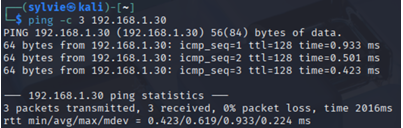

# II.2 Audit de sécurité Active Directory

Une phase d’énumération passive et active a été réalisée dans le cadre de l’audit de sécurité Active Directory.

Cette phase constitue une étape fondamentale de l’audit interne et vise à :
- cartographier le réseau interne ;
- identifier les hôtes et services exposés ;
- détecter des faiblesses de configuration exploitables ;
- évaluer les risques de compromission du domaine Active Directory

Cette section complète l’analyse de surface d’attaque présentée en II.1, en détaillant la méthodologie d’énumération réseau ayant permis d’identifier les services Active Directory exposés.

**Remarque :** Toutes les actions décrites ci‑dessus sont réalisées dans un environnement de laboratoire pédagogique. Les comptes utilisés sont des comptes test et aucun système réel n’est impacté. L’objectif est de reproduire des scénarios de compromission Active Directory en toute sécurité
### II.2.1 Méthodologie

L’énumération a été réalisée de manière progressive, en privilégiant dans un premier temps des techniques peu intrusives, puis des scans plus ciblés sur les services Active Directory.

Cette approche permet de :
- limiter l’impact sur les systèmes audités ;
- reproduire une démarche réaliste d’attaquant interne ;
- collecter des informations exploitables pour les phases suivantes de l’audit.


## II.2.2 Phase 1 : Énumération réseau et identification des services

#### Test de connectivité

Un test de connectivité est réalisé afin de valider la portée réseau et de confirmer la présence des hôtes actifs sur le réseau interne.

Cette étape permet de vérifier la communication entre la machine d’audit et les systèmes cibles avant toute phase de scan plus intrusive.



#### Scan réseau global

Un scan réseau global est ensuite effectué afin d’identifier les machines présentes sur le réseau ainsi que les ports ouverts associés à chaque hôte.

**Commande utilisée :**
```bash
nmap -sS -Pn -T4 192.168.1.0/24
```

Ce scan permet notamment d’identifier :
- le contrôleur de domaine ;
- les postes membres du domaine ;
- les services exposés sur le réseau interne.

### II.2.3 Services Active Directory surveillés

Une attention particulière est portée aux ports suivants, considérés comme critiques dans un environnement Active Directory :

|Port|Service|Description|
|---|---|---|
|88|Kerberos|Authentification du domaine|
|135|RPC|Communication inter‑services Windows|
|139|NetBIOS|Résolution de noms legacy|
|389|LDAP|Annuaire Active Directory|
|445|SMB|Partage de fichiers / authentification Windows|
|636|LDAPS|LDAP chiffré|
Ces ports sont “normaux” dans un AD, mais leur exposition sur un réseau non segmenté est problématique.

**Résultat attendu :**  
Identification du contrôleur de domaine, des postes membres et des services Active Directory accessibles depuis le réseau interne.

### II.2.4 Impact sécurité

L’exposition des services Active Directory sur le réseau interne constitue une surface d’attaque critique.

Un attaquant disposant d’un accès réseau, même avec des privilèges limités, est en mesure de :
- identifier le contrôleur de domaine ;
- cartographier les services d’authentification et d’annuaire ;
- préparer des attaques ciblées sur Kerberos, LDAP ou SMB.

Ces informations sont essentielles pour initier des attaques de compromission Active Directory.

Les résultats de cette phase d’énumération réseau servent de point d’entrée aux phases d’énumération avancée et de compromission décrites dans les sections suivantes.

Cette phase d’énumération correspond aux tactiques Discovery et Credential Access du framework MITRE ATT&CK, et prépare les phases d’analyse de privilèges et de mouvement latéral.
### II.2.5 Transition vers l’analyse des relations de privilèges

La phase d’énumération réseau a permis d’identifier la présence d’un contrôleur de domaine Active Directory, ainsi que l’exposition de services critiques tels que LDAP, Kerberos, SMB et WinRM.

L’accès à ces services, combiné à la compromission préalable d’un compte utilisateur standard, permet d’envisager une analyse plus approfondie des relations de privilèges au sein de l’annuaire Active Directory.

Dans cette continuité, l’outil BloodHound est utilisé afin de cartographier les relations entre utilisateurs, groupes, ordinateurs et permissions, et d’identifier des chemins d’escalade de privilèges qui ne sont pas visibles lors d’une simple énumération des services.

Dans ce scénario, l’accès aux services AD est réalisé depuis la machine interne compromise via WordPress, illustrant l’impact direct d’une application web exposée sur la sécurité globale du domaine. Cette situation permet d’envisager la compromission d’un compte utilisateur standard pour initier une escalade de privilèges complète via BloodHound.

## II.2.6 Schéma synthétique du flux d’attaque

Compte utilisateur compromis (poste client / AD)
         ↓
Énumération réseau et services AD (Nmap, LDAP, Kerberos)
         ↓
Analyse des relations de privilèges (BloodHound, SharpHound)
         ↓
Identification des machines avec admin local / sessions actives
         ↓
Exécution distante (PsExec / Meterpreter)
         ↓
Token impersonation / extraction de hash
         ↓
Propagation latérale et accès aux serveurs critiques
         ↓
Escalade finale → Compte Domain Admin

Ce flux démontre qu’une exposition non segmentée des services Active Directory, combinée à des délégations de privilèges excessives, suffit à compromettre intégralement le domaine sans aucune vulnérabilité logicielle.

## 2.7 Alignement des phases d’attaque avec le framework MITRE ATT&CK

| Phase                 | MITRE ATT&CK                     |
| --------------------- | -------------------------------- |
| Énumération réseau    | Discovery                        |
| Analyse AD            | Discovery / Privilege Escalation |
| Exécution distante    | Lateral Movement                 |
| Extraction hash       | Credential Access                |
| Escalade Domain Admin | Privilege Escalation             |
Les différentes étapes observées dans le scénario d’attaque peuvent être alignées avec les tactiques du framework MITRE ATT&CK, permettant de structurer l’analyse selon un référentiel reconnu internationalement.

