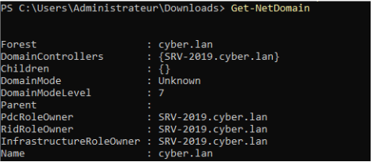
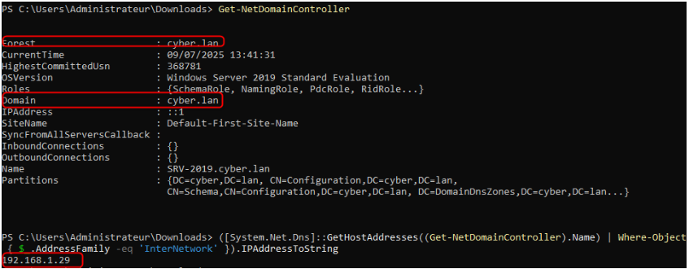
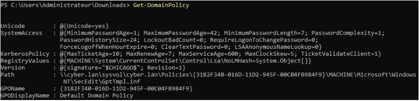
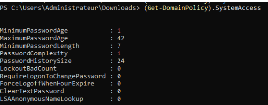
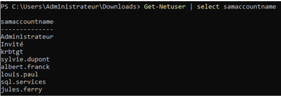
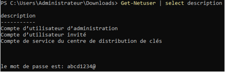
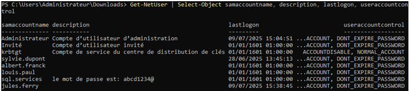
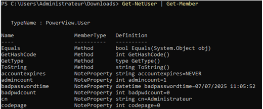

# II.4 Audit Active Directory : PowerView

## II.4.1 Objectif de la phase

Après l’énumération réseau et la récupération de comptes, PowerView a été utilisé pour :

- Cartographier le domaine AD (utilisateurs, machines, contrôleurs de domaine, groupes)
- Identifier les comptes sensibles et les privilèges exposés
- Analyser la politique de mot de passe et la configuration Kerberos
- Détecter les mauvaises pratiques ou configurations à risque

**Contexte :** audit interne / post-compromission → priorisation des mesures de durcissement.

Cette phase post-compromission s’inscrit après un accès initial obtenu via un serveur WordPress compromis, illustrant la progression d’un attaquant interne vers l’énumération et la compromission Active Directory
## II.4.2 Fonctionnalités clés de PowerView

|Catégorie|Cmdlet PowerView|Objectif|
|---|---|---|
|Utilisateurs|`Get-NetUser`, `Get-UserProperty`|Identifier tous les comptes AD|
|Ordinateurs|`Get-NetComputer`|Lister les machines du domaine|
|Contrôleurs de domaine|`Get-NetDomainController`|Récupérer DC et IP critique|
|Groupes AD|`Get-NetGroup`, `Get-NetGroupMember`|Identifier groupes et membres|
|Sessions actives|`Get-NetSession`, `Get-NetLoggedon`|Identifier connexions en cours|
|Partages|`Find-DomainShare`, `Invoke-ShareFinder`|Identifier partages accessibles|
|Politique mot de passe|`Get-DomainPolicy`|Examiner sécurité et complexité|
|Comptes de service|`Get-NetSPN`|SPN exposés / Kerberoasting|
|Relations de confiance|`Get-NetDomainTrust`|Trusts inter-domaines|
|SID du domaine|`Get-DomainSID`|Identifier le SID du domaine|

## II.4.3 Énumération et analyse du domaine

Informations générales sur le domaine

`Get-NetDomain`

- Nom du domaine
- SID
- Paramètres globaux AD

## II.4.4 Contrôleurs de domaine

`Get-NetDomainController`

- Nom du DC
- Adresse IP
- Rôle critique dans l’authentification

## II.4.5 Politique de sécurité du domaine

`Get-DomainPolicy`

Analyse de la politique de mot de passe

Paramètres principaux observés

`(Get-DomainPolicy).SystemAccess`

**Analyse des paramètres et lien offensive**

| Paramètre                    | Valeur  | Analyse / Recommandation                            | Impact pour un attaquant                                                                                       |
| ---------------------------- | ------- | --------------------------------------------------- | -------------------------------------------------------------------------------------------------------------- |
| MinimumPasswordLength        | 7       | Faible, recommandé ≥12 ; ≥14 pour comptes sensibles | Mot de passe court → brute-force ou password spraying plus rapide → escalade vers comptes sensibles            |
| MaximumPasswordAge           | 42 j    | Acceptable                                          | Si attaquant obtient le hash, rotation limitée → persistance temporaire prolongée                              |
| MinimumPasswordAge           | 1 j     | Correct                                             | Empêche réinitialisation immédiate par utilisateur pour contrer attaque, faible risque                         |
| PasswordComplexity           | Activée | Correct                                             | Renforce la difficulté de brute-force, mais longueur courte reste un vecteur                                   |
| PasswordHistorySize          | 24      | Correct                                             | Empêche réutilisation immédiate → limite certaines attaques, positif                                           |
| LockoutBadCount              | 0       | Verrouillage désactivé ; recommandé ≥5 tentatives   | Attaques de brute-force / password spraying peuvent être répétées sans blocage → escalade plus facile          |
| ClearTextPassword            | 0       | Correct                                             | Pas de stockage en clair → réduit risque d’exfiltration directe                                                |
| RequireLogonToChangePassword | 0       | Permet changement sans session sécurisée            | Un attaquant ayant accès à un compte compromis peut modifier mot de passe sans contrôle, prolonger persistance |
**Lien offensive :**

- Une politique trop permissive ou non appliquée permet attaque par brute-force, password spraying, et maintien d’accès prolongé (persistance).
- Les comptes sensibles ou administratifs avec mot de passe court / jamais expiré sont vecteurs directs pour l’escalade de privilèges.
### II.4.5.1 Impact potentiel

- Risque accru de compromission par brute-force ou password spraying
- Exploitation facilitée si hash NTLM fuit

### II.4.5.2 Recommandations

- Longueur minimale ≥ 12 caractères (≥ 14 pour comptes sensibles)
- Activer `LockoutBadCount` et définir `LockoutDuration`
- Appliquer des Fine-Grained Password Policies pour comptes admins et services

> Les Fine-Grained Password Policies permettent des règles différentes pour certains groupes ou utilisateurs, contrairement à la politique standard du domaine.

Règles spécifiques appliquées aux comptes privilégiés, indépendamment de la politique globale.

## II.4.6 Politique Kerberos

| Paramètre            | Valeur | Analyse                              | Impact offensif                                                                                      |
| -------------------- | ------ | ------------------------------------ | ---------------------------------------------------------------------------------------------------- |
| MaxTicketAge         | 10 h   | Limite durée des tickets             | Permet à un attaquant de voler un ticket TGT et l’utiliser pendant 10 h → mouvement latéral possible |
| MaxRenewAge          | 7 j    | Correct                              | TGT renouvelable → prolongation persistance si compromis                                             |
| MaxServiceAge        | 600 s  | Correct                              | Ticket de service limité → réduit window d’exploitation pour Kerberoasting                           |
| MaxClockSkew         | 5 min  | Correct                              | Limite erreurs d’authentification, faible risque                                                     |
| TicketValidateClient | Activé | Protège contre clients non autorisés | Réduit risque exploitation Kerberos via clients falsifiés                                            |
**LM Hash désactivé (NoLMHash = 1)** → réduit risque de compromission facile par cracking, positif pour la sécurité.

### II.4.6.1 Synthèse et recommandations opérationnelles

**Risque global : Moyen à élevé**

- Les mots de passe courts, absence de verrouillage et politiques non différenciées pour comptes sensibles → accès prolongé / escalade rapide possible
- Kerberos correctement configuré mais tickets TGT exploitables pour mouvement latéral et persistance

**Recommandations tactiques :**

1. Longueur minimale ≥12 caractères (≥14 pour comptes sensibles)
2. Activer `LockoutBadCount` et définir `LockoutDuration` → limiter brute-force/password spraying
3. Fine-Grained Password Policies pour comptes admins / services → réduire surface d’attaque pour comptes sensibles
4. Surveiller via SIEM : logs de tentatives échouées, anomalies Kerberos

**Lien MITRE ATT&CK / opérationnel :**

- Password policy faible → Credential Access / Persistence / Privilege Escalation
- Tickets Kerberos exploitables → Lateral Movement / Credential Access
### II.4.6.2 Sécurité additionnelle : LM Hash

- **NoLMHash = 1** → désactive stockage des LM Hash (très faibles et facilement cassables).
- Appliqué via registre 

`HKLM\SYSTEM\CurrentControlSet\Control\Lsa\NoLMHash = 1`

- Redémarrage nécessaire pour prise d’effet

**Niveau de risque : faible**, si tous les systèmes respectent ce paramètre.

## II.4.7 Synthèse de la politique de sécurité du domaine

|Élément|Évaluation|
|---|---|
|Points forts|Complexité mot de passe, historique, LM hashes désactivés, Kerberos OK|
|Points faibles|Longueur minimale faible, verrouillage de compte absent|
|Risque global|Élevé pour comptes utilisateurs / service|

**Utilité dans audit / pentest :**

- Identifier failles exploitables
- Évaluer résistance aux attaques par mot de passe
- Comprendre contraintes Kerberos
- Prioriser actions de durcissement AD

**Conclusion :**  
La politique présente une bonne base, mais nécessite des ajustements (longueur de mot de passe, verrouillage) pour alignement avec les bonnes pratiques et réduction significative du risque de compromission.

## II.4.8 Enumération des comptes utilisateurs Active Directory

**Commande principale**

`Get-NetUser`

  
Autre commandes:

  
  

**Objectif :**

- Identifier comptes actifs/inactifs, sensibles, techniques ou obsolètes
- Évaluer exposition aux attaques et vecteurs de persistance / escalade

### II.4.8.1 Comptes à risque identifiés

|Type de compte|Risque|Recommandation|Exploitation potentielle|Tactique MITRE|
|---|---|---|---|---|
|`PasswordNeverExpires = True`|Élevé|Supprimer cette option, rotation régulière, utiliser gMSA si nécessaire|Persistance prolongée → un attaquant peut garder un accès non détecté|T1078 (Valid Accounts)|
|Inactifs > 90 j|Élevé|Désactiver ou supprimer après validation métier|Persistance → réactivation possible pour mouvement latéral ou escalade si droit sur groupe sensible|T1078 (Valid Accounts)|
|Membres de groupes sensibles|Critique|Restreindre au minimum, appliquer principe du moindre privilège, revue régulière|Escalade directe → accès aux Domain Admins ou administrateurs locaux|T1068 / T1078|
|Sans description|Moyen à élevé|Ajouter description claire, identifier responsable métier ou technique|Risque de confusion pour l’audit, facilite la création de comptes « fantômes » pour persistance|T1078 / T1482 (Domain Trust Discovery)|
**Explication :**  
Chaque compte peut être utilisé par un attaquant pour escalade de privilèges, persistance ou mouvement latéral.

- **Escalade de privilèges** → accéder à des comptes administrateurs ou à des systèmes critiques
- **Persistance** → garder un accès non détecté pendant des semaines ou mois
- **Mouvement latéral** → se déplacer d’un serveur ou poste à un autre via des droits hérités ou partagés.

gMSA (Group Managed Service Account) : compte de service géré automatiquement par AD, rotation des mots de passe sécurisée.

### II.4.8.2 Propriétés analysées via `Get-NetUser`

|Propriété|Description|Utilité|
|---|---|---|
|samaccountname|Nom de connexion|Identification des comptes|
|cn|Nom complet|Vérification de cohérence|
|description|Description du compte|Justification métier|
|distinguishedname|DN complet dans AD|Localisation dans l’OU|
|lastlogon / lastlogontimestamp|Dernière connexion|Détection comptes inactifs|
|pwdlastset|Dernier changement mot de passe|Rotation mots de passe|
|useraccountcontrol|Flags du compte|Statut, mot de passe, désactivation|
|memberof|Groupes d’appartenance|Privilèges|
|badpwdcount|Tentatives échouées|Indicateur attaque|
|logoncount|Connexions réussies|Usage réel|
|accountexpires|Expiration du compte|Comptes temporaires|
|admincount|Appartenance groupes protégés|Comptes critiques|
|objectsid|SID unique|Référence sécurité|
|whencreated / whenchanged|Création / modification|Détection comptes anciens ou récents|
**Analyse complémentaire**

- Comptes rarement utilisés ou inactifs → vecteur de persistance
- Comptes à privilèges mal contrôlés → risque critique
- Comptes sans description → traçabilité faible
- Tentatives échouées élevées → brute force ou compromission

## II.4.9 Recommandations générales

#### Gouvernance des comptes

- Désactiver ou supprimer comptes inactifs (> 90 jours)
- Documenter usage et responsable (`description`)
- Restreindre membres des groupes sensibles
- Revue périodique des comptes

#### Politiques de mot de passe

- Longueur minimale ≥ 12 caractères
- Activer verrouillage après échec (`LockoutBadCount`)
- Fine-Grained Password Policies pour comptes admin / services
- Supprimer `PasswordNeverExpires` pour comptes non techniques

#### Surveillance

- Journaliser `badPwdCount` et alertes SIEM
- Corréler logs pour détecter activité anormale
- Surveiller comptes sensibles

## II.4.10 Analyse des groupes, ACL et GPO

#### Groupes AD

- Enumération : `Get-NetGroup`
- Vérification des membres : `Get-NetGroupMember`
- Identification des groupes sensibles et critiques

**Lien offensive :** 

Membres de groupes sensibles mal contrôlés peuvent permettre à un attaquant d’obtenir des privilèges étendus immédiatement. Exemple : un utilisateur membre de “Domain Admins” → contrôle total de l’AD.

#### ACL sur OU et objets

- Vérification : `Get-ACL` / `Get-ObjectAcl`
- Détection droits excessifs ou hérités
- Contrôle principe du moindre privilège

**Lien offensive :**

- ACL trop permissives permettent modification de comptes, création de comptes administrateur ou déploiement de scripts → persistance et escalade de privilèges..
- Les droits hérités sur des objets critiques sont des vecteurs pour création de compte administrateur ou mouvement latéral.

#### Partages réseau

- Enumération SMB : `Invoke-ShareFinder`
- Détection accès trop permissif → fuite de données / mouvement latéral

**Lien offensive :**  
Un partage mal sécurisé permet à un attaquant de déposer des outils, scripts ou vol de données, et de se déplacer facilement sur le réseau.
#### GPO

- Liste GPO : `Get-NetGPO`
- Vérification ACL et scripts : `Get-ObjectAcl`, `Get-GPResultantSetOfPolicy`
- Détection modifications récentes ou suspectes

GPO mal configurées peuvent exécuter du code sur tous les postes ciblés, ou modifier mots de passe → mouvement latéral et persistance.

**Lien offensive :**

- GPO critiques mal configurées peuvent permettre l’exécution de code à distance sur tous les postes ciblés par la GPO
- Possibilité de réinitialiser mots de passe ou d’escalader privilèges sur les machines concernées

### Résumé tactique MITRE ATT&CK / opérationnel

- **Comptes sensibles** → Credential Access / Privilege Escalation
- **ACL/GPO trop permissifs** → Privilege Escalation / Persistence / Lateral Movement
- **Partages exposés** → Lateral Movement / Exfiltration

**Objectif :** chaque information récupérée n’est pas seulement descriptive, mais a un **impact concret sur la sécurité du domaine**.
### II.4.10.1 Recommandations Groupes, ACL et GPO

- Restreindre groupes sensibles et supprimer membres inactifs
- Vérifier et corriger ACL héritées ou excessives
- Limiter accès aux partages réseau
- Sécuriser GPO critiques et documenter modifications

## II.4.11 schéma synthétique de flux d’attaque avec PowerView

Accès initial
  (compte utilisateur / serveur WordPress compromis)
        ↓
Énumération du domaine AD
  (PowerView : Get-NetUser, Get-NetComputer, Get-NetDomainController)
        ↓
Analyse des comptes sensibles, groupes et permissions
  (Get-NetGroupMember, ACL, GPO)
        ↓
Identification des vecteurs d’escalade et persistance
  (PasswordNeverExpires, SPN, membres Domain Admin)
        ↓
Exploitation / mouvements latéraux
  (Lateral Movement via partages, sessions actives, tickets Kerberos)
        ↓
Escalade de privilèges
  (Privilege Escalation → comptes administratifs / Domain Admin)
        ↓
Maintien d’accès / persistance prolongée
  (Credential Access / TGT / tickets Kerberos)

Ce flux illustre comment un attaquant interne pourrait exploiter un accès initial pour énumérer le domaine, identifier des comptes sensibles, se déplacer latéralement et finalement obtenir des privilèges Domain Admin. Chaque étape correspond à des vecteurs réels utilisés dans les tests de pénétration et à des tactiques MITRE ATT&CK.

## II.4.12 Table de correspondance MITRE ATT&CK

| Étape PowerView / audit   | MITRE ATT&CK                     |
| ------------------------- | -------------------------------- |
| Énumération du domaine    | Discovery                        |
| Analyse comptes & ACL/GPO | Discovery / Privilege Escalation |
| Identification vecteurs   | Credential Access / Persistence  |
| Mouvement latéral         | Lateral Movement                 |
| Escalade Domain Admin     | Privilege Escalation             |
La table montre la correspondance entre les étapes réalisées avec PowerView et les tactiques MITRE ATT&CK. Cela permet de relier les actions d’audit ou post-compromission à des menaces connues et d’évaluer le risque de compromission du domaine Active Directory.
## II.4.13 Synthèse des niveaux de risque identifiés

| Domaine analysé              | Niveau de risque | Justification |
|-----------------------------|-----------------|---------------|
| Comptes sensibles           | **Critique**    | Présence de comptes à privilèges élevés, comptes inactifs ou mal contrôlés, et options à risque (`PasswordNeverExpires`), facilitant l’escalade de privilèges et la persistance. |
| Politique de mot de passe   | Moyen           | Complexité activée et Kerberos correctement configuré, mais longueur minimale insuffisante et absence de verrouillage de compte, exposant le domaine aux attaques par brute-force et password spraying. |
| ACL / GPO                   | Moyen à élevé   | Droits potentiellement excessifs ou hérités sur les groupes, OU, partages et GPO, pouvant être exploités pour du mouvement latéral ou une élévation de privilèges. |

## II.4.14 Conclusion générale

- Bonne base de sécurité : complexité mot de passe, LM hashes désactivés, Kerberos correct
- Faiblesses critiques : longueur mot de passe faible, verrouillage absent, comptes sensibles mal contrôlés, comptes inactifs
- Priorité d’action : comptes sensibles => politiques mot de passe => ACL et GPO => surveillance SIEM
- Recommandations appliquées => réduction significative de la surface d’attaque et risque de compromission

Les vulnérabilités identifiées correspondent à des tactiques MITRE ATT&CK telles que Credential Access, Privilege Escalation et Lateral Movement, pouvant mener à une compromission complète du domaine si elles sont exploitées.

Les comptes sensibles constituent le principal facteur de risque et doivent être traités en priorité, suivis par le renforcement des politiques de mot de passe et la revue des ACL et GPO afin de réduire durablement la surface d’attaque Active Directory.

