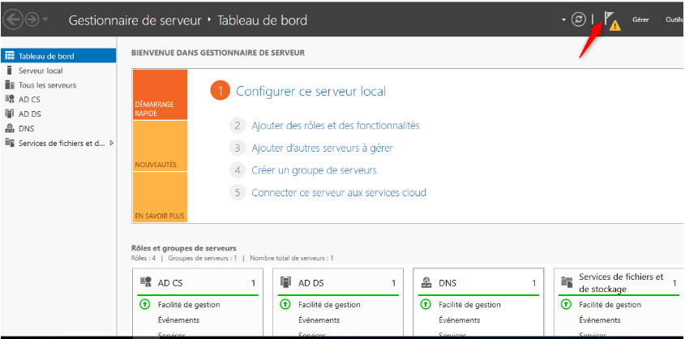
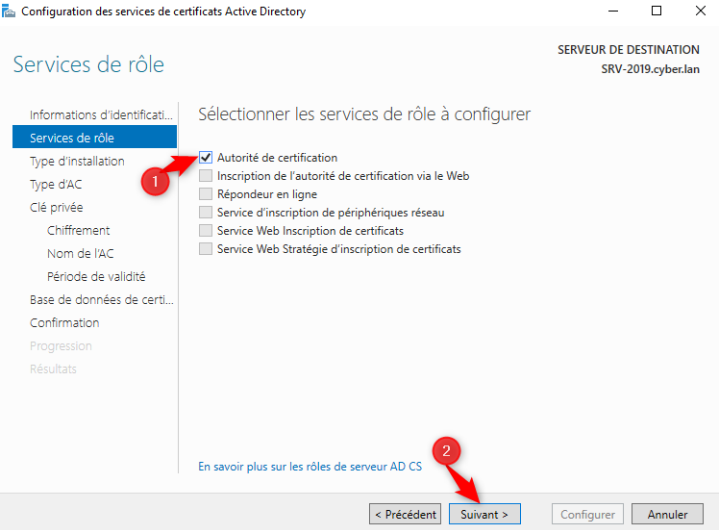
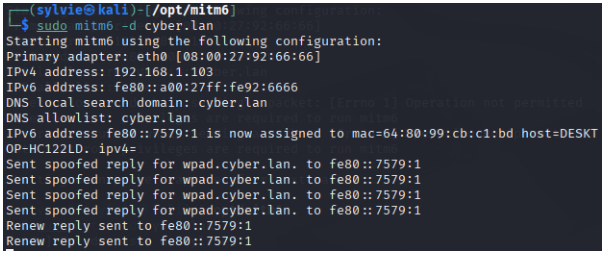
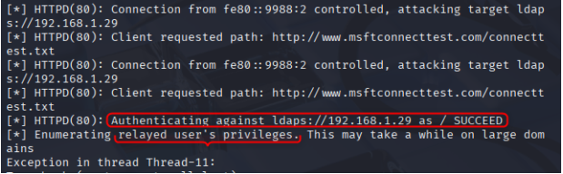
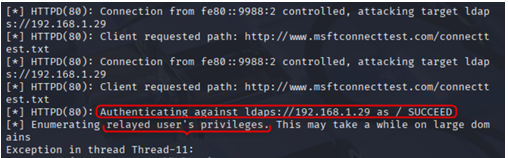

# III.4 Vulnérabilité critique : NTLM Relay vers AD CS via IPv6

Cette attaque s’inscrit dans la continuité directe des attaques NTLM Relay précédentes.

Cette vulnérabilité permet à un attaquant interne non authentifié de :
- intercepter des authentifications NTLM automatiques ;
- relayer ces authentifications vers AD CS ;
- obtenir un certificat valide ;
- s’authentifier via Kerberos sans mot de passe ;
- maintenir un accès persistant au domaine.

**Impact potentiel : compromission complète du domaine Active Directory.**
## III.4.1 Contexte et prérequis

Cette section présente un scénario d’attaque avancé combinant :
- IPv6 activé par défaut sur les postes Windows
- NTLM Relay
- Active Directory Certificate Services (AD CS)

Ce scénario permet à l’attaquant d’obtenir un accès furtif et prolongé au domaine Active Directory.

Dans le cadre du laboratoire, le rôle Active Directory Certificate Services (AD CS) a été volontairement installé sur le contrôleur de domaine afin d’évaluer l’impact d’une configuration par défaut ou insuffisamment durcie.

**Chemin d’installation :**  
Gestionnaire de serveur => Ajouter des rôles et fonctionnalités

  


## III.4.2 Constat d’audit critique

Une configuration faible ou par défaut d’AD CS constitue un facteur aggravant majeur, car elle permet :
- le relais NTLM vers les services AD CS ;
- l’exploitation de scénarios connus tels que ESC8 (_ESC8 = NTLM Relay vers les services Web AD CS_) ;
- l’émission de certificats frauduleux pour des comptes utilisateurs ou machines ;
- une compromission persistante du domaine Active Directory.

Dans ce scénario, l’attaquant obtient un certificat valide lui permettant une authentification Kerberos légitime, sans jamais connaître le mot de passe du compte ciblé.

## III.4.3 Chaîne d’attaque démontrée (PoC)

La chaîne d’attaque observée est la suivante :
1. Empoisonnement IPv6 via MITM6
2. Détournement DNS / WPAD
3. Déclenchement automatique d’authentifications NTLM
4. Relais NTLM vers AD CS (HTTP / LDAPS)
5. Délivrance d’un certificat frauduleux
6. Accès persistant au domaine Active Directory

**Niveau de gravité : Critique**

L’attaque reste invisible pour les mécanismes classiques de surveillance.

## III.4.4 Empoisonnement IPv6 : MITM6

Cette étape est similaire à l’attaque MITM6 décrite précédemment, mais utilisée ici comme vecteur d’abus AD CS.

`sudo mitm6 -d cyber.lan`



### III.4.4.1 Effets observés

- MITM6 se présente comme un serveur DHCPv6 et DNS IPv6 malveillant
- Les postes Windows privilégient automatiquement IPv6
- Les requêtes DNS et WPAD sont redirigées vers l’attaquant
- Des authentifications NTLM automatiques sont déclenchées sans interaction utilisateur

Cette phase permet de positionner l’attaquant en Man‑in‑the‑Middle sur le réseau interne.

### III.4.4.2 Relais NTLM vers Active Directory (ntlmrelayx)

L’outil ntlmrelayx.py (suite Impacket) permet de :
- intercepter des authentifications NTLM ;
- les relayer vers des services cibles (SMB, LDAP, LDAPS, HTTP) ;
- exploiter des mécanismes d’authentification faibles sans connaître le mot de passe.

**Relation MITM6 / ntlmrelayx :**

- MITM6 déclenche et capte les authentifications NTLM ;
- ntlmrelayx exploite activement ces authentifications.

### III.4.4.3 Relais NTLM vers LDAPS

```bash
python3 ntlmrelayx.py -6 \ -t ldaps://192.168.1.29 \ -wh fakewpad.cyber.lan \ -l lootme
```


Authentification LDAPS réussie, privilèges de l’utilisateur relayé obtenus.

|Option|Description|
|---|---|
|`-6`|Activation du support IPv6|
|`-t ldaps://192.168.1.29`|Relais NTLM vers LDAP sécurisé|
|`-wh fakewpad.cyber.lan`|Serveur WPAD malveillant|
|`-l lootme`|Répertoire de stockage des données|
L’utilisation de LDAPS ne protège pas contre le relais NTLM en l’absence de Channel Binding et de signature LDAPS obligatoire.
LDAPS chiffre le trafic, mais ne protège pas contre le relais si :

- LDAP Signing n’est pas obligatoire ;
- Extended Protection for Authentication (EPA / Channel Binding) n’est pas activé.
#### Objectif de l’attaque

Exploiter une authentification NTLM automatique afin d’interagir avec Active Directory via LDAPS, notamment pour :
- lire et modifier des objets AD ;
- exploiter AD CS (ESC8) ;
- obtenir des privilèges persistants.

#### Constat d’audit

Cette attaque est rendue possible par :
- l’autorisation de NTLM ;
- l’absence de signature LDAP obligatoire ;
- une configuration permissive d’AD CS.

**Niveau de gravité : Critique**

### III.4.4.4 Résultats observés


Authentification LDAPS réussie, privilèges de l’utilisateur relayé obtenus.
### III.4.4.5 Création du répertoire `lootme`

- Le répertoire `lootme/` est créé avec succès
- Cela confirme :
    - la capture d’une authentification NTLM valide ;
    - son relais effectif vers LDAPS ;
    - une interaction réussie avec Active Directory.

### III.4.4.6 Extraction d’informations Active Directory

Plusieurs artefacts ont été générés automatiquement, notamment :
- `domain_users_by_group.html`

Ce fichier contient :
- la liste des utilisateurs du domaine ;
- les groupes Active Directory ;
- les relations d’appartenance et de privilèges.

Cette extraction démontre une capacité de lecture AD sans identifiants connus.

## III.4.5 Impact critique sur AD et AD CS

Dans le cadre de la preuve de concept :
- des objets Active Directory ont été modifiés ;
- les changements sont visibles depuis le contrôleur de domaine ;
- cette action démontre une capacité d’écriture AD, dépendante du compte relayé.

## III.4.6 Impact spécifique AD CS - ESC8

Cette attaque permet :
- l’émission de certificats frauduleux ;
- une authentification Kerberos légitime ;
- un accès persistant au domaine Active Directory.
Contrairement aux mots de passe, les certificats émis ne sont pas invalidés par une rotation des identifiants, ce qui rend cette compromission particulièrement persistante.

Tant que le certificat n’est pas révoqué ou expiré, l’attaquant conserve un accès valide au domaine, même après changement de mot de passe du compte ciblé.

## III.4.7 Chaîne d’attaque résumée

1. IPv6 activé par défaut
2. MITM6
3. Détournement DNS / WPAD
4. Authentification NTLM automatique
5. NTLM Relay vers LDAPS
6. Interaction Active Directory (lecture / écriture)
7. Abus AD CS (ESC8)

L’attaquant conserve un accès au domaine sans déclencher d’alerte, même après modification des mots de passe.

**Schéma de la chaîne d’attaque**

IPv6 activé
     ↓
MITM6
     ↓
WPAD / DNS détourné
     ↓
Authentifications NTLM automatiques
     ↓
NTLM Relay → LDAPS
     ↓
Interaction AD / abus AD CS
     ↓
Certificat frauduleux / accès persistant

## III.4.8 Risques pour l’entreprise

Cette vulnérabilité expose l’entreprise à :
- une compromission partielle ou totale du domaine ;
- la création d’objets persistants (comptes, groupes, certificats) ;
- une élévation de privilèges progressive ;
- le contournement des mécanismes d’authentification classiques ;
- des attaques silencieuses difficilement détectables sans supervision avancée.

**Facteurs techniques ayant permis l’attaque**

| Élément vulnérable | Configuration observée | Impact            |
| ------------------ | ---------------------- | ----------------- |
| IPv6 activé        | Activé par défaut      | MITM possible     |
| WPAD               | Activé                 | Déclenche NTLM    |
| NTLM               | Autorisé               | Relay possible    |
| LDAP Signing       | Non obligatoire        | Relais LDAPS      |
| Channel Binding    | Non activé             | Contournement TLS |
| AD CS              | Modèles vulnérables    | ESC8 exploitable  |
## III.4.9 Recommandations de mitigation

#### Réseau et IPv6

- Désactiver IPv6 lorsqu’il n’est pas nécessaire
- Déployer des protections réseau :
    - RA Guard (Router Advertisement Guard)
- Désactiver WPAD, ou imposer une configuration proxy statique via GPO
#### Authentification et protocoles

- Restreindre puis désactiver NTLM
- Forcer la signature SMB
- Forcer la signature LDAP et le Channel Binding
- Privilégier Kerberos comme mécanisme unique

> Le **Channel Binding** lie l’authentification au canal TLS utilisé, empêchant le relais NTLM.

#### Active Directory Certificate Services (AD CS)

- Auditer intégralement la configuration AD CS
- Supprimer ou durcir les modèles de certificats vulnérables
- Restreindre l’émission de certificats
- Journaliser et surveiller les opérations liées aux certificats
#### Supervision et détection

- Surveiller :
    - authentifications NTLM anormales ;
    - modifications d’objets AD ;
    - opérations LDAP inhabituelles.
- Centraliser les journaux dans un SIEM
- Mettre en place des alertes sur événements critiques

Détection SIEM :
- Windows Event ID 4769 : demande de certificat
- Event ID 4776 : tentative NTLM relay

```bash
Détection SIEM :
- Windows Event ID 4769 : demande de certificat
- Event ID 4776 : tentative NTLM relay

```


### III.4.10 Correspondance MITRE ATT&CK

| Tactique             | Technique                            | ID        | Description             |
| -------------------- | ------------------------------------ | --------- | ----------------------- |
| Initial Access       | Adversary-in-the-Middle              | T1557     | MITM via IPv6           |
| Credential Access    | NTLM Relay                           | T1557.001 | Relais NTLM             |
| Persistence          | Abuse of Authentication Certificates | T1649     | Certificats AD CS       |
| Privilege Escalation | Valid Accounts                       | T1078     | Accès Kerberos légitime |
| Lateral Movement     | SMB/LDAP                             | T1021     | Accès aux services AD   |

## III.4.11 Évaluation du risque

- Probabilité : Élevée (exploitable en interne sans privilèges)
- Impact : Critique (compromission du domaine)
- Niveau de risque global : Critique
## III.4.12 Conclusion

L’audit de sécurité de l’infrastructure ICMAC démontre qu’un réseau IPv4 apparemment sécurisé peut être entièrement compromis via IPv6, en exploitant des mécanismes activés par défaut et rarement surveillés.
La combinaison MITM6 + NTLM Relay + AD CS permet une compromission :
- invisible pour les mécanismes de surveillance ; 
- accès prolongé au domaine ; 
- impact critique sur l’intégrité du domaine Active Directory.

Ce scénario souligne l’importance d’une approche globale de la sécurité, intégrant :
- la gestion des protocoles hérités ;
- le durcissement des services Active Directory ;
- une supervision avancée des authentifications réseau.

L’attaquant conserve un accès au domaine sans déclencher d’alerte, même après modification des mots de passe.