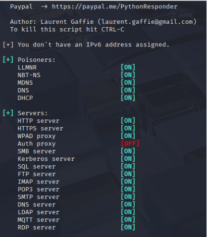
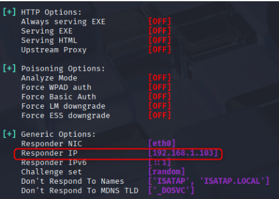
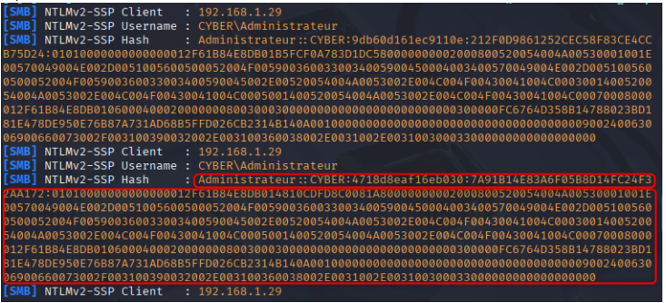

## III.1.1 Phase 2 : Compromission initiale par empoisonnement LLMNR

Cette phase s’inscrit entre l’énumération réseau et l’énumération Active Directory avancée

L’énumération Active Directory est réalisée à l’aide des protocoles SMB et LDAP afin de :
- identifier les services d’authentification exposés ;
- détecter la présence de protocoles de résolution de noms legacy ;
- évaluer les mécanismes de sécurité en place sur le réseau interne.

Cette phase permet de préparer l’exploitation de faiblesses liées à la résolution de noms et aux mécanismes d’authentification Windows.

## III.1.2 Vulnérabilité : LLMNR Poisoning

LLMNR (_Link‑Local Multicast Name Resolution_) est un protocole Windows permettant de résoudre des noms d’hôtes lorsqu’aucun serveur DNS ne répond. Bien que fonctionnel, il peut être exploité pour intercepter des identifiants Windows en réseau interne, constituant un risque critique dans un environnement Active Directory.

**Exemple de fonctionnement :**
- Un poste tente d’accéder à `\\intranet.local`
- Le serveur DNS ne répond pas ou ne connaît pas le nom
- Une requête LLMNR est diffusée sur le réseau local :  
    _« Qui est intranet.local ? »

Ce mécanisme, bien que fonctionnel, introduit un risque de sécurité majeur lorsqu’il est activé dans un environnement Active Directory.

## III.1.3 Principe de l’attaque LLMNR Poisoning

Le **LLMNR Poisoning** est une attaque de type _spoofing_ réalisable sans interaction utilisateur :
1. Écoute les requêtes LLMNR diffusées sur le réseau local ;
2. Répond frauduleusement en se faisant passer pour la machine recherchée ;
3. Induit le poste victime en erreur ;
4. Capture les informations d’authentification Windows sous forme de hash NTLM

Cette attaque ne nécessite aucune interaction utilisateur et peut être réalisée par tout attaquant disposant d’un accès au réseau interne.

## III.1.4 Outil utilisé : Responder

L’outil Responder est utilisé afin d’intercepter et d’usurper les requêtes de résolution de noms.

**Commande utilisée :**

```bash
sudo responder -I eth0 -wdv
```

#### Objectifs de la commande

- Intercepter les requêtes LLMNR / NBT‑NS / mDNS
- Simuler des services réseau (SMB, HTTP, DNS)
- Capturer les hashs NTLMv2 envoyés par les postes Windows

  


## III.1.5 Exemple d’exploitation observé

Dans l’environnement audité, le scénario suivant a été observé :
1. Un poste Windows tente d’accéder à une ressource inexistante
2. Le nom n’est pas résolu par le serveur DNS
3. Responder répond frauduleusement à la requête LLMNR
4. Le poste Windows initie une tentative d’authentification
5. Le hash NTLMv2 est transmis à la machine de l’attaquant



Ce scénario illustre comment un simple poste Windows, en cherchant une ressource inexistante, peut involontairement divulguer ses identifiants NTLMv2 à un attaquant interne.
## III.1.6 Stockage des identifiants capturés

Les hashs NTLMv2 capturés par Responder sont stockés localement sur la machine d’audit :

```bash
cd /usr/share/responder/logs/
```

Les fichiers générés contiennent notamment :
- le nom d’utilisateur ;
- le hash NTLMv2 ;
- l’adresse IP de la machine victime ;
- le nom de domaine.

Ces informations peuvent ensuite être utilisées pour :
- du cracking hors ligne ;
- des attaques Pass‑the‑Hash ;
- une compromission progressive du domaine Active Directory.
## III.1.7 Conditions nécessaires à l’exploitation

- LLMNR activé sur les postes Windows
- Absence de réponse DNS valide
- Accès réseau interne de l’attaquant
- Aucun mécanisme de protection type SMB signing obligatoire
## III.1.8 Impact sécurité

LLMNR activé constitue une vulnérabilité critique permettant la capture d’identifiants Windows et le mouvement latéral au sein du domaine.
### III.1.8.1 Correspondance MITRE ATT&CK

Cette attaque s’inscrit dans plusieurs tactiques et techniques du framework MITRE ATT&CK, notamment :

- **Credential Access** : capture de hashs NTLMv2 via empoisonnement LLMNR ;
- **Lateral Movement** : réutilisation des identifiants capturés pour accéder à d’autres systèmes du domaine ;
- **Discovery** : identification implicite des postes actifs et des comptes utilisateurs via les requêtes de résolution de noms.

Ces techniques constituent un point d’entrée classique dans les chaînes d’attaque Active Directory.

**Position dans la chaîne d’attaque :** Initial Access => Credential Access => Lateral Movement

| Tactique MITRE ATT&CK | Technique                 | ID        | Description                                                                       |
| --------------------- | ------------------------- | --------- | --------------------------------------------------------------------------------- |
| Credential Access     | LLMNR/NBT-NS Poisoning    | T1557.001 | Capture d’identifiants Windows via empoisonnement LLMNR / NBT-NS                  |
| Credential Access     | OS Credential Dumping     | T1003     | Exploitation des hashs NTLM capturés pour authentification ou cracking hors ligne |
| Lateral Movement      | Pass-the-Hash             | T1550.002 | Réutilisation des hashs NTLM pour authentification sur d’autres systèmes          |
| Discovery             | Network Service Discovery | T1046     | Identification des hôtes et services via trafic de résolution de noms             |

## III.1.9 Recommandations

- Désactiver LLMNR et NBT-NS via GPO sur tous les postes Windows.
- Forcer l’utilisation exclusive du DNS interne pour toutes les résolutions de noms.
- Activer SMB Signing afin d’empêcher tout relais NTLM non autorisé.
- Mettre en place une surveillance proactive des tentatives d’authentification anormales via SIEM/ELK.
- Détecter et alerter sur les hashs capturés et les tentatives d’empoisonnement LLMNR/NBT-NS, flux SMB suspects ou Pass-the-Hash, afin d’identifier précocement toute activité offensive.

La surveillance proactive transforme cette vulnérabilité en indicateur de menace, limitant le mouvement latéral et renforçant la défense du domaine Active Directory.

## III.1.10 Conclusion de la phase LLMNR Poisoning

Cette phase montre qu’un simple accès réseau interne permet l’interception d’identifiants Windows valides à cause des protocoles legacy activés par défaut, sans exploiter de vulnérabilité logicielle.
Cette vulnérabilité peut permettre à un attaquant interne de démarrer une attaque sur le domaine Active Directory si elle n’est pas corrigée et surveillée.
