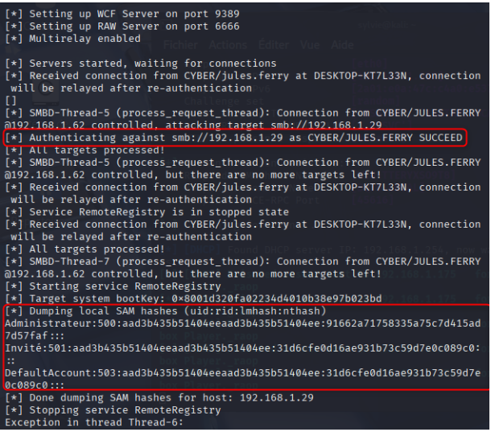
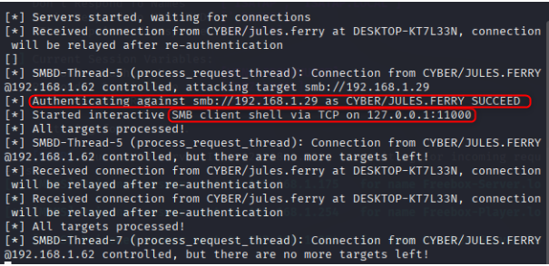
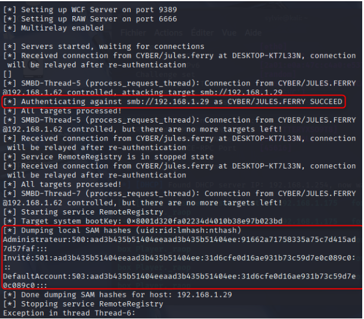
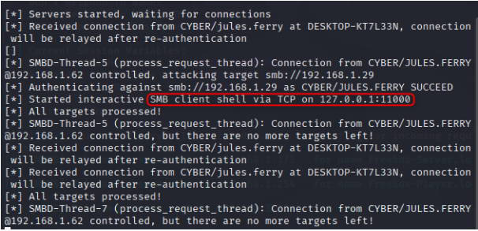
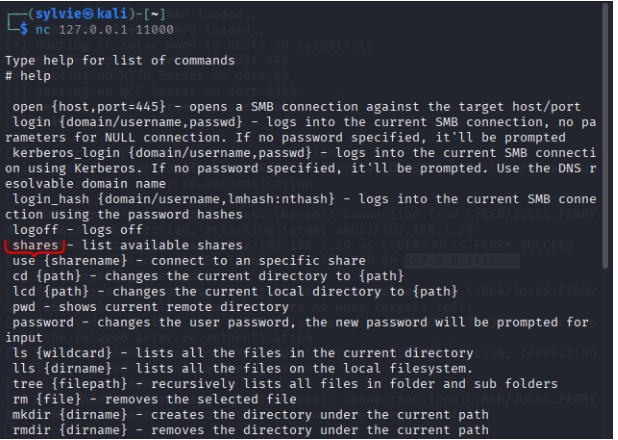
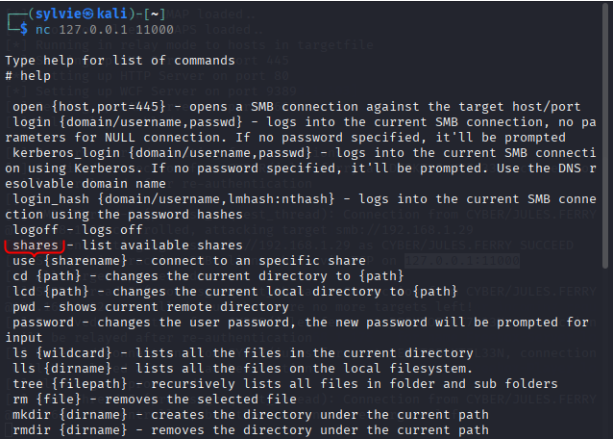
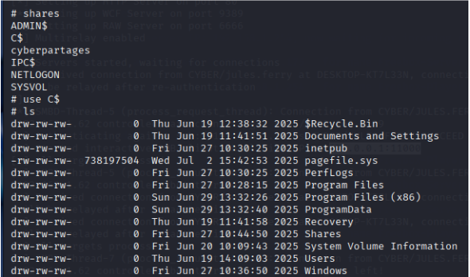

# III.3  Vulnérabilité SMB Relay

Cette vulnérabilité s’inscrit dans la continuité directe de la phase de capture d’identifiants NTLM (LLMNR Poisoning). Les authentifications interceptées peuvent être soit craquées hors ligne, soit relayées en temps réel vers des services vulnérables, sans connaissance du mot de passe.
## III.3.1 Description

L’attaque SMB Relay est une attaque réseau ciblant le protocole SMB (Server Message Block), largement utilisé dans les environnements Windows pour le partage de fichiers, d’imprimantes et de ressources réseau.

Cette attaque exploite le mécanisme d’authentification NTLM lorsqu’il est encore actif et que la signature SMB n’est pas imposée.

Dans ce contexte, un attaquant peut relayer une tentative d’authentification légitime vers un autre service SMB et s’authentifier sans connaître le mot de passe de la victime.

Cette attaque est possible uniquement lorsque la signature SMB n’est pas imposée côté serveur.

## III.3.2 Fonctionnement

Le principe de l’attaque repose sur les étapes suivantes :
1. Un utilisateur tente d’accéder à une ressource réseau via SMB
2. L’attaquant intercepte la requête d’authentification NTLM
3. Les informations d’authentification sont relayées vers un autre serveur SMB vulnérable
4. Le serveur cible accepte l’authentification relayée
5. L’attaquant obtient un accès aux ressources du serveur cible sous l’identité de la victime

Cette attaque est particulièrement critique lorsque l’utilisateur compromis possède des droits administrateur.
## III.3.3 Impact

L’exploitation d’une attaque SMB Relay peut entraîner les conséquences suivantes :
- Accès non autorisé à des ressources sensibles
- Usurpation d’identité d’utilisateurs légitimes
- Élévation de privilèges, notamment via des comptes à droits élevés
- Mouvement latéral au sein du réseau Active Directory
- Compromission de serveurs critiques

Les impacts métiers associés incluent :
- Vol de données sensibles
- Déploiement de ransomware
- Interruption de services
- Compromission globale du système d’information

**Niveau de criticité : critique
### III.3.4 Environnement

- **Entreprise** : ICMAC
- **Infrastructure** :
    - Active Directory
    - Serveurs Windows (Windows Server)
    - Serveur Linux / WordPress
- **Plage réseau** : 192.168.1.0/24
## III.3 Vérifications

### III.3.1 Analyse SMB

Afin d’évaluer l’exposition de l’infrastructure aux attaques SMB Relay, un scan de sécurité SMB a été réalisé à l’aide de Nmap.

```bash
sudo nmap --script=smb2-security-mode.nse -p445 192.168.1.0/24
```
#### Objectifs du test

- Vérifier si la signature SMB est activée et obligatoire
- Identifier l’utilisation de NTLM comme mécanisme d’authentification
- Détecter les hôtes vulnérables aux attaques de type SMB Relay
### III.3.2 Constats

Le protocole NTLM est actif et la signature SMB n’est pas imposée, exposant le serveur à des attaques de type SMB Relay.
### III.3.3  Exploitation confirmée

### III.3.3.1 Résumé 

Lors de l’audit, une attaque SMB Relay a été menée avec succès contre un serveur Windows de l’infrastructure ICMAC.

Cette attaque a permis :
- Une authentification réussie sous l’identité d’un utilisateur légitime
- L’accès aux ressources administratives du serveur cible
- Le dump des hashes NTLM locaux (SAM), incluant le compte Administrateur

Cette exploitation confirme une compromission critique du serveur cible.
### III.3.3.2 Authentification relayée

##### Résultat observé

Authenticating against smb://192.168.1.29 as CYBER/JULES.FERRY SUCCEED



L’attaquant s’est authentifié avec succès sur le serveur 192.168.1.29 sous l’identité CYBER/JULES.FERRY.
## III.3.3.3 Dump SAM

À la suite de l’attaque SMB Relay réussie, un accès administratif a été obtenu sur le serveur cible, permettant l’extraction de la base SAM (Security Account Manager) locale.



**Résultat**
- Extraction complète de la base SAM locale
- Récupération des hashes NTLM des comptes locaux
- Compromission confirmée du compte Administrateur
### III.3.3.4 Impact sécurité

Les hashes NTLM récupérés peuvent être exploités de plusieurs manières :
- Craquage hors ligne par dictionnaire ou force brute
- Attaques Pass-the-Hash sur d’autres systèmes
- Maintien d’un accès persistant au serveur compromis

Cette étape permet une prise de contrôle durable du serveur, même en cas de changement de mot de passe utilisateur.

**Niveau de gravité : Critique**

## III.3.3.5 Chaîne d’attaque

Cette section décrit la chaîne d’attaque complète ayant conduit à la compromission du serveur Windows.

### III.3.4 Outils et préparation (Responder)

L’outil Responder a été utilisé afin d’intercepter les requêtes d’authentification réseau et de préparer l’attaque de type Man-in-the-Middle.

```bash
sudo responder -I eth0 -dwv
```

#### Objectifs

- Capture des requêtes d’authentification NTLM
- Exploitation des protocoles de résolution de noms non sécurisés
- Préparation à l’attaque SMB Relay

### III.3.4.1 Objectifs de l’attaque

- Relayer les authentifications NTLM capturées vers des serveurs SMB vulnérables
- S’authentifier auprès des services SMB sans connaître le mot de passe
- Obtenir un accès distant aux ressources du serveur cible
- Ouvrir une session interactive sous l’identité de la victime

_Les authentifications relayées proviennent des captures NTLM effectuées précédemment avec Responder.”_  
Cela renforce la traçabilité dans la chaîne d’attaque.

Commande utilisée :
```bash
sudo python3 /usr/share/doc/python3-impacket/examples/ntlmrelayx.py \ -tf targets.txt \ -smb2support \ -i
```
- Relais des authentifications NTLM vers les serveurs cibles
- Option -i activée pour ouvrir un shell interactif
### III.3.4.2 Exploitation : shell interactif

Connexion interactive ouverte pour vérifier les privilèges obtenus

`nc 127.0.0.1 11000`

### III.3.4.3 Résultats et accès ADMIN$

- Relais réussi des authentifications NTLM
- Accès aux services SMB sous l’identité de la victime
- Ouverture d’un shell interactif sur le serveur cible

**Accès ADMIN$**

À la suite de l’attaque SMB Relay, un accès au partage administratif du serveur cible a été obtenu, confirmant un niveau de privilèges élevé.


**Résultat**
- Accès réussi au partage administratif ADMIN$
- Confirmation de droits administrateur local sur la machine cible
Cela confirme une prise de contrôle complète de la machine cible.
### III.3.4.4 Vérification des privilèges

Exécution de commandes pour confirmer le niveau de privilèges via ntlmrelayx.



**Objectif**

- Vérifier l’identité de l’utilisateur exécutant les commandes
- Confirmer le niveau de privilèges obtenu sur la machine cible

Accès confirmé sous l’identité de la victime

### III.3.4.5 Cartographie MITRE ATT&CK

| Tactique | Technique | ID | Description |
|--------|----------|----|------------|
| Credential Access | NTLM Relay | T1557 | Relais d’authentification NTLM |
| Lateral Movement | SMB/Windows Admin Shares | T1021.002 | Accès via SMB |
| Credential Access | Dump SAM | T1003.002 | Extraction des identifiants locaux |
| Privilege Escalation | Abuse of Admin Rights | T1068 | Accès administrateur local |

**Position dans la chaîne d’attaque :**  
Initial Access => Credential Access => Lateral Movement => Privilege Escalation

## III.3.5 Conclusion du test SMB Relay

#### Résumé

L’attaque SMB Relay a permis :
- Une authentification NTLM frauduleuse réussie
- Un accès administrateur à un serveur Windows
- Le vol des hashes NTLM locaux
- Une compromission complète de la machine cible

Les protections suivantes sont absentes ou insuffisantes :
- Signature SMB obligatoire
- Restriction ou désactivation de NTLM
- Segmentation et cloisonnement des privilèges

#### Évaluation du risque

|Critère|Niveau|
|---|---|
|Impact|Critique|
|Probabilité|Élevée|
|Exploitabilité|Facile|
|Étendue|Domaine Active Directory|
Cette vulnérabilité constitue une menace majeure pour la sécurité globale du SI.

## III.3.6 Mesures de mitigation

#### Renforcement SMB

- Désactiver SMBv1
- Activer et imposer la signature SMB
- Restreindre ou désactiver NTLM au profit de Kerberos
#### Gestion des privilèges

- Appliquer strictement le principe du moindre privilège
- Séparer comptes utilisateurs et comptes d’administration
- Limiter l’usage des partages administratifs
#### Sécurité avancée

- Activer Credential Guard
- Surveiller les authentifications NTLM (SIEM / logs sécurité)
- Segmenter les accès administratifs

Cette attaque montre qu’un simple accès réseau interne, combiné à des configurations par défaut vulnérables, peut permettre une compromission rapide et silencieuse des serveurs critiques.
