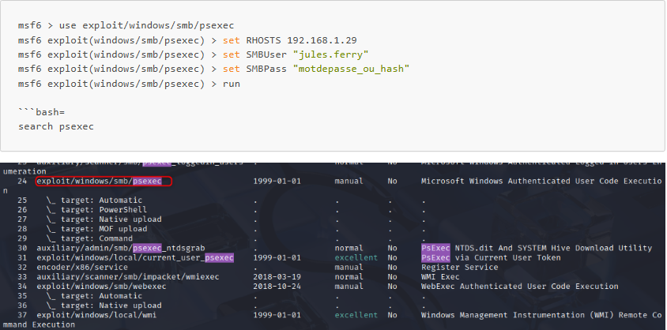
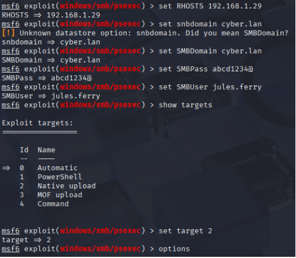
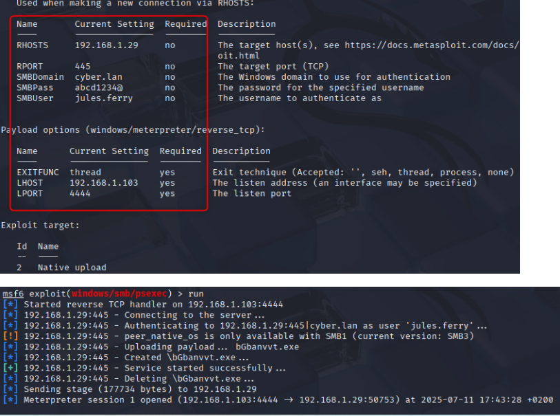
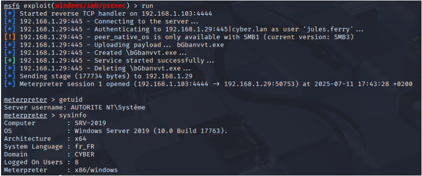
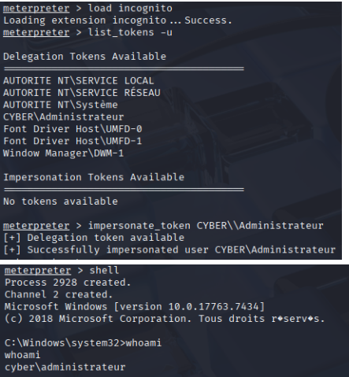
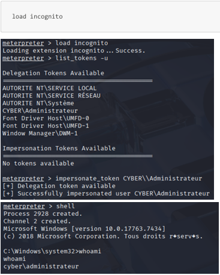
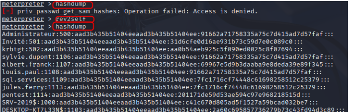

# IV.4 Post‑Compromission Active Directory

Ce scénario démontre comment, à partir d’identifiants compromis, un attaquant peut obtenir une exécution de code distante et escalader ses privilèges sur un serveur Active Directory, sans exploitation de vulnérabilité logicielle, en s’appuyant exclusivement sur des mauvaises pratiques de configuration.

## IV.4.0 Chaîne d’attaque et contexte

À partir d’un compte utilisateur standard compromis, un attaquant peut progressivement étendre son contrôle sur l’infrastructure Active Directory en exploitant des mauvaises pratiques de gestion des identités et de configuration. Le chemin typique comprend :

1. Énumération des comptes de service Active Directory.
2. Extraction de tickets Kerberos (Kerberoasting) et craquage hors ligne des mots de passe faibles.
3. Utilisation d’un compte de service compromis pour s’authentifier avec des privilèges administratifs sur plusieurs systèmes.
4. Mouvement latéral et extraction d’identifiants supplémentaires, conduisant à une élévation progressive jusqu’aux comptes critiques du domaine.

Cette chaîne démontre qu’une faiblesse initiale, apparemment non critique, combinée à des pratiques de sécurité insuffisantes, peut suffire à compromettre complètement le domaine sans recourir à l’exploitation de vulnérabilités logicielles.

## IV.4.1 Exploitation via Metasploit - PsExec (SMB)

### IV.4.1.1 Résultat et interprétation

Cette exploitation démontre qu’à partir d’identifiants compromis,
un attaquant peut obtenir une exécution de code distante sur un serveur Windows
et élever ses privilèges jusqu’au niveau administrateur,
sans exploitation de vulnérabilité logicielle.

## IV.4.2 Technique utilisée : PsExec (SMB) - Metasploit Framework

Le module `exploit/windows/smb/psexec` de Metasploit permet :
- l’authentification via SMB (mot de passe ou hash NTLM),
- la création d’un service Windows distant,
- l’exécution d’un payload arbitraire sur la machine cible.

Cette technique repose exclusivement sur :
- des identifiants valides
- des droits administrateur locaux
- une configuration NTLM permissive

**Paramétrage du module**

Paramètres utilisés :
- **RHOSTS** : 192.168.1.29
- **SMBUser** : jules.ferry
- **SMBPass** : mot de passe / hash NTLM
- **Payload** : `meterpreter/reverse_tcp`

Résultat obtenu

---

- Une session Meterpreter est obtenue avec succès
- Confirmation que le compte compromis dispose de droits administrateur locaux
- Exécution de code distante effective sur le serveur cible

## IV.4.3 Post‑exploitation via Meterpreter

Les extensions suivantes ont été utilisées :

|Extension|Objectif|
|---|---|
|stdapi|Fichiers, processus, réseau|
|priv|Manipulation des privilèges|
|incognito|Énumération et usurpation de tokens|
|kiwi|Extraction d’identifiants (type Mimikatz)

---
## IV.4.4 Élévation de privilèges : Token Impersonation

L’extension incognito a permis :
- l’énumération des tokens disponibles,
- l’identification d’un token CYBER\Administrateur (session active),
- l’usurpation de ce token,
- l’ouverture d’un shell avec privilèges élevés.

 **Preuve** :
 

Cette élévation est réalisée sans exploit, uniquement par :
- mauvaise gestion des sessions
- absence d’isolation des privilèges
### IV.4.4.1 Extraction des hashs locaux (SAM)

 - Accès aux hashs NTLM des comptes locaux
- Possibilité de Pass‑the‑Hash et propagation latérale

### IV.4.4.2 Impact sécurité

**Gravité : critique**

Cette attaque permet :
- Exécution de commandes à distance
- Vol de hashs NTLM et secrets en mémoire
- Usurpation de sessions administrateur
- Création de comptes persistants
- Propagation latérale rapide
- Compromission complète des serveurs critiques

## IV.4.5 Lien avec les faiblesses observées

|Faiblesse|Impact|
|---|---|
|Réutilisation d’identifiants|Pass‑the‑Hash|
|Sessions admin actives|Token impersonation|
|NTLM autorisé|PsExec / CME|
|Absence de Credential Guard|Vol LSASS|
|Segmentation insuffisante|Propagation rapide|

## IV.4.6 Synthèse exécutive de la Post-Compromission via Metasploit

| Élément                   | Observation                  | Impact sécurité              | Criticité    |
| ------------------------- | ---------------------------- | ---------------------------- | ------------ |
| Identifiants compromis    | Authentification SMB réussie | Accès initial aux serveurs   | Élevée       |
| PsExec via Metasploit     | Exécution de code distante   | Contrôle total de la machine | **Critique** |
| Droits admin locaux       | Présents sur le serveur      | Élévation immédiate          | **Critique** |
| Session admin active      | Token Administrateur usurpé  | Escalade sans exploit        | **Critique** |
| Extraction LSASS / SAM    | Hashs NTLM récupérés         | PtH et propagation           | **Critique** |
| Absence Credential Guard  | Secrets exposés              | Vol d’identités              | **Critique** |
| Segmentation insuffisante | Aucun cloisonnement          | Propagation latérale         | Élevée       |
| Persistance possible      | Comptes / services           | Accès durable                | **Critique** |

## IV.4.7 Mapping MITRE ATT&CK des Techniques observées

| Tactique             | Technique             | ID MITRE  | Description                        |
| -------------------- | --------------------- | --------- | ---------------------------------- |
| Initial Access       | Valid Accounts        | T1078     | Utilisation d’identifiants valides |
| Execution            | Service Execution     | T1569.002 | PsExec via SMB                     |
| Privilege Escalation | Token Impersonation   | T1134     | Usurpation de token admin          |
| Credential Access    | OS Credential Dumping | T1003     | Extraction LSASS / SAM             |
| Lateral Movement     | SMB / Admin Shares    | T1021.002 | Propagation via SMB                |
| Persistence          | Create Account        | T1136.001 | Comptes persistants                |
| Defense Evasion      | Pass-the-Hash         | T1550.002 | Authentification sans mot de passe |
| Command & Control    | Reverse TCP           | T1571     | Session Meterpreter                |
## IV.4.8 Conclusion audit

> _L’exploitation de PsExec via Metasploit démontre qu’un attaquant disposant d’identifiants valides peut obtenir une exécution de code distante et élever ses privilèges jusqu’au niveau administrateur, sans exploitation de vulnérabilité logicielle._
>
> _La combinaison de NTLM permissif, de privilèges administrateur locaux, de sessions actives et de l’absence de Credential Guard conduit à une compromission totale des serveurs critiques._
>
> **Niveau de risque global : critique.**

### IV.4.9 Synthèse de la chaîne d’attaque globale

Cette démonstration met en évidence que :

- Même un compte utilisateur standard compromis peut, par Kerberoasting et mouvements latéraux, permettre l’accès à des comptes administrateurs.
- Les mauvaises pratiques de gestion des identités et les configurations permissives sur les serveurs facilitent la propagation et l’élévation de privilèges.
- L’attaque ne nécessite aucun exploit logiciel, ce qui souligne la criticité des contrôles d’accès, de la segmentation et de la protection des comptes à privilèges.

La combinaison d’identifiants compromis et de configurations faibles suffit à réaliser une compromission complète du domaine, ce qui justifie un renforcement immédiat des pratiques de sécurité et de la gestion des comptes.

