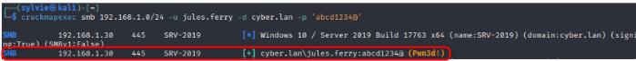
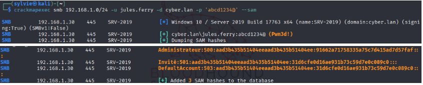
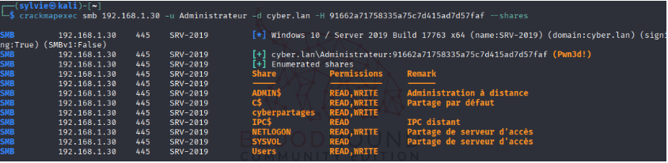
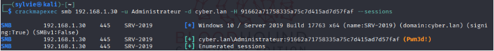
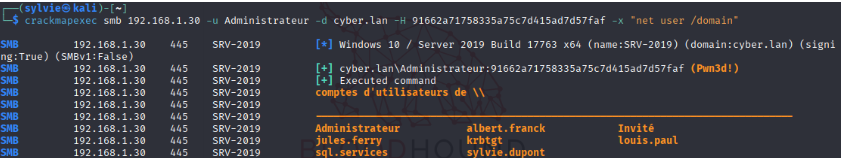
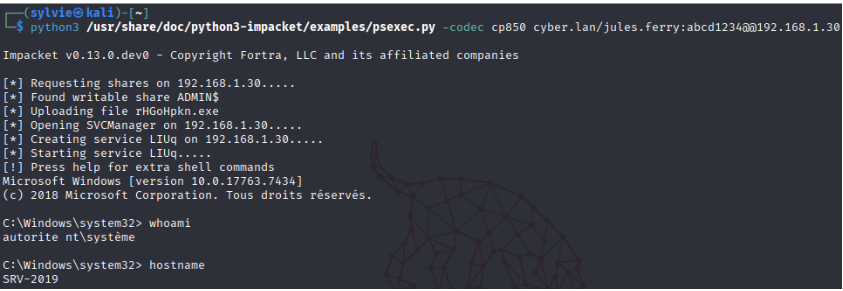
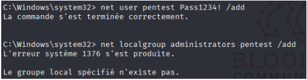
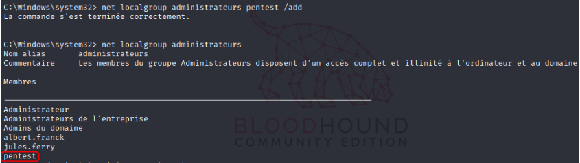
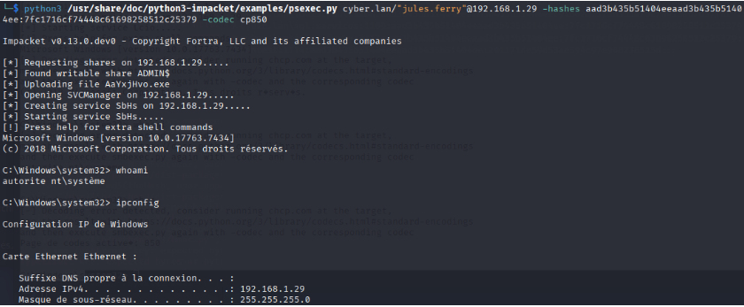

# IV.3 Phase Post‑Compromission Active Directory

## IV.3.1 Introduction

Cette phase d’audit évalue l’impact réel de la compromission d’un compte utilisateur au sein de l’infrastructure Active Directory de l’entreprise fictive ICMAC.

Contrairement aux phases précédentes, cette étape se place dans un scénario réaliste :

> **L’attaquant dispose déjà d’identifiants valides appartenant à un utilisateur du domaine.**

L’objectif est de montrer comment, sans exploiter de vulnérabilité logicielle, un attaquant peut :

- se déplacer latéralement dans le réseau interne ;
- exploiter des droits administrateur locaux mal maîtrisés ;
- réutiliser des identités compromises (mot de passe ou hash NTLM) ;
- préparer une élévation de privilèges vers des comptes critiques du domaine.

Les techniques principales utilisées sont :
- Pass‑the-Password (PtP) ;
- Pass‑the-Hash (PtH) ;
- Outils de post‑exploitation Active Directory comme CrackMapExec.

Cette phase illustre que la sécurité d’un domaine Active Directory repose autant sur la gestion des identités et des privilèges que sur la configuration des services.
## IV.3.2 Exploitation des identités compromises : Pass-the-Hash et Pass-the-Password

### IV.3.2.1 Contexte et scénario d’attaque

À partir des phases d’énumération Active Directory (PowerView, BloodHound), cette étape montre comment un mot de passe ou hash NTLM valide peut être utilisé pour :

- s’authentifier sur plusieurs machines ;
- exploiter des droits administrateur locaux excessifs ;
- se déplacer latéralement 
- préparer une élévation vers des comptes sensibles.

Outils évalués :

- Pass‑the-Password (PtP)
- Pass‑the-Hash (PtH)
- CrackMapExec (CME)

## IV.3.3 Chaîne d’attaque synthèse : De l’accès utilisateur standard à Domain Admin

### IV.3.3.1 Vue d’ensemble

La compromission d’un compte standard, combinée à de mauvaises pratiques de configuration Active Directory, peut mener à un contrôle complet du domaine en plusieurs phases.

### IV.3.3.2 Phase 1 : Accès initial

- Compte utilisateur standard obtenu via LLMNR Poisoning ou compromission légitime.
- Privilèges limités, mais suffisants pour interagir avec Active Directory.

### IV.3.3.3 Phase 2 : Énumération AD

- Énumération LDAP (utilisateurs, groupes, SPN)
- Analyse des relations de privilèges avec BloodHound
- Accès aux partages SYSVOL et NETLOGON
- Identification de comptes de service mal configurés

### IV.3.3.4 Phase 3 : Kerberoasting

- Identification des comptes avec SPN
- Extraction de tickets Kerberos TGS via Impacket (`GetUserSPNs.py`)
- Crack offline pour obtenir les mots de passe de comptes de service

### IV.3.3.5 Phase 4 : Mouvement latéral

- Authentification sur serveurs membres (SMB / WinRM / PsExec)
- Pass‑the-Hash ou Pass‑the-Ticket
- Accès à des systèmes critiques avec sessions admin actives

### IV.3.3.6 Phase 5 : Élévation de privilèges

- Usurpation de tokens d’un administrateur de domaine
- Extraction de credentials en mémoire (absence de Credential Guard)
- Exploitation de relations de confiance BloodHound
- Récupération de mots de passe stockés dans GPP

### IV.3.3.7 Phase 6 : Persistance

- Création de comptes administrateurs persistants
- Modification de GPO pour backdoors
- Altération des mécanismes d’authentification
- Maintien d’accès long terme
## IV.3.4 Impact global sur le système d’information

Cette chaîne d’attaque démontre que :
- un simple compte utilisateur peut suffire à compromettre l’ensemble du domaine ;
- l’absence de durcissement des comptes de service est critique ;
- les mécanismes Kerberos, bien que robustes, peuvent être détournés ;
- les faiblesses de configuration se cumulent et s’amplifient.

**Impact final : compromission complète de l’Active Directory et du SI associé.

## IV.3.5 Contre‑mesures prioritaires

| Priorité | Mesure                                                                      |
| -------- | --------------------------------------------------------------------------- |
| Critique | Déployer gMSA et supprimer les mots de passe faibles des comptes de service |
| Critique | Désactiver LLMNR / NBT‑NS                                                   |
| Élevée   | Supprimer les mots de passe stockés dans GPP                                |
| Élevée   | Activer Credential Guard                                                    |
| Élevée   | Surveiller Kerberos (Event ID 4769)                                         |
| Moyenne  | Auditer régulièrement les relations de privilèges (BloodHound)              |

## IV.3.5.1 Synthèse de la chaîne d’attaque

À partir d’un compte standard compromis, l’attaquant peut :

1. Énumérer les comptes de service dans Active Directory.
2. Extraire des tickets Kerberos (Kerberoasting) et cracker hors ligne les mots de passe faibles.
3. Exploiter uncompte de service compromis  pour obtenir une authentification administrative sur plusieurs systèmes.
4. Effectuer le mouvement latéral, extraire d’autres identifiants et s’élever progressivement jusqu’aux comptes critiques du domaine.

> **Conclusion clé :** une faiblesse initiale non critique combinée à de mauvaises pratiques de gestion des identités peut conduire à la compromission totale du domaine sans exploiter de vulnérabilité logicielle.

## IV.3.6 Techniques utilisées

### IV.3.6.1 Pass‑the-Password (PtP)

- Utilisation directe d’un mot de passe en clair pour s’authentifier sur d’autres machines
### IV.3.6.2 Pass‑the-Hash (PtH)

- Utilisation d’un hash NTLM pour s’authentifier sans connaître le mot de passe réel.

### IV.3.6.3 Outil utilisé : CrackMapExec (CME)

CrackMapExec est un outil de post‑exploitation dédié aux environnements Active Directory.

| Fonction           | Description                      |
| ------------------ | -------------------------------- |
| Scan SMB / WinRM   | Découverte des hôtes et services |
| Authentification   | Test avec mot de passe ou hash   |
| Pass-the-Hash      | Connexion via NTLM hash          |
| Énumération SMB    | Liste des partages               |
| Sessions actives   | Utilisateurs connectés           |
| Exécution distante | Commandes à distance             |

## IV.3.7 Tests d’authentification réalisés

### IV.3.7.1 Test Pass-the-Password

```bash
crackmapexec smb 192.168.1.0/24 -u jules.ferry -d cyber.lan -p 'abcd1234@'
```



**Interprétation :**

- L’authentification SMB a réussi.
- Le compte `jules.ferry` est valide sur le serveur cible.
- Le statut `(Pwn3d!)` indique un accès effectif, potentiellement exploitable.
- Extraction possible des hashs NTLM des comptes locaux.
- Possibilité de réutilisation immédiate pour une escalade ou un mouvement latéral

### IV.3.7.2 Informations système récupérées

- **OS :** Windows Server 2019 (Build 17763, x64)
- **Domaine :** cyber.lan
- **SMB Signing :** Activé
- **SMBv1 :** Désactivé (bonne pratique)

### IV.3.7.3 Impact du test

- Authentification réussie grâce à un mot de passe valide compromis.
- Accès administrateur sur une ou plusieurs machines du domaine.
- Possibilité d’exécution de commandes à distance.
- Possibilité d’extraction ultérieure des hashs NTLM des comptes locaux.
- Facilitation du mouvement latéral au sein du réseau.

Ce scénario est représentatif d’une compromission initiale via phishing, fuite de mots de passe ou password spraying, suivie d’un mouvement latéral interne, sans exploitation de vulnérabilité logicielle.

### IV.3.7.4 Impact sécurité

Ces techniques démontrent qu’un simple compte utilisateur compromis peut :

- se propager rapidement sur le réseau interne ;
- exploiter des droits administrateur locaux mal maîtrisés ;
- préparer une élévation de privilèges vers des comptes critiques ;
- compromettre durablement l’Active Directory.

Elles soulignent l’importance de :
- la protection des identifiants utilisateurs ;
- la restriction des droits administrateur locaux ;
- la désactivation ou la limitation de NTLM ;
- la supervision des authentifications SMB.
## IV.3.8 Extraction des hash locaux (SAM)

```bash
crackmapexec smb 192.168.1.0/24 -u jules.ferry -d cyber.lan -p 'abcd1234@' --sam
```



### IV.3.8.1 Résultat et interprétation

L’extraction de la base SAM locale est possible sur les systèmes où le compte compromis dispose de droits administrateur locaux.

Les hashs NTLM récupérés peuvent alors être :

- réutilisés directement dans des attaques Pass-the-Hash ;
- crackés hors ligne afin d’obtenir les mots de passe en clair.

Cette capacité transforme une compromission utilisateur en vecteur de propagation latérale rapide.

## IV.3.9 Exploitation Pass-the-Hash

```bash
crackmapexec smb 192.168.1.0/24 -u Administrateur -d cyber.lan -H 91662a71758335a75c7d415ad7d57faf
```




### IV.3.9.1 Analyse

- `-H` : authentification à l’aide d’un hash NTLM, sans connaissance du mot de passe en clair.
- Tentative d’authentification automatique sur l’ensemble des machines du réseau cible.
- En cas de succès :
    - accès administrateur immédiat ;
    - absence totale d’interaction utilisateur ;
    - aucune alerte liée à une tentative de connexion par mot de passe incorrect.

Cette technique exploite directement la logique d’authentification NTLM, où le hash devient l’équivalent fonctionnel du mot de passe.

### IV.3.9.2 Impact

- Compromission de plusieurs machines par réutilisation de hash NTLM.
- Mouvement latéral rapide et silencieux au sein du réseau interne.
- Possibilité d’exécution de commandes à distance (SMB, PsExec, WinRM).
- Escalade de privilèges potentielle à l’échelle du domaine en présence de :
    - comptes administrateurs partagés ;
    - privilèges excessifs ;
    - absence de segmentation administrative.

## IV.3.9.3 Risques identifiés

- Réutilisation de mots de passe administrateur locaux.
- Comptes Administrateur local identiques sur plusieurs machines.
- Absence de mécanismes de protection efficaces contre le Pass‑the‑Hash.
- Compromission possible du domaine à partir d’un seul hash NTLM

## IV.3.9.4 Recommandations

**Mesures prioritaires**

- Activer Credential Guard sur les postes et serveurs.
- Désactiver ou restreindre l’utilisation de NTLM via GPO.
- Déployer LAPS (Local Administrator Password Solution) pour les comptes administrateur locaux.

L’absence de LAPS favorise la réutilisation des mots de passe locaux, rendant les attaques Pass‑the‑Hash extrêmement efficaces.

- Appliquer strictement le principe du moindre privilège.
- Surveiller les connexions SMB anormales :
    - Event ID 4624 (connexion réussie),
    - Event ID 4648 (connexion avec informations explicites).
- Segmenter le réseau afin de limiter la propagation latérale.

## IV.3.10 Focus sécurité : LAPS (Local Administrator Password Solution)

LAPS est une solution Microsoft destinée aux environnements Active Directory permettant de gérer automatiquement les mots de passe des comptes administrateur locaux sur les postes et serveurs Windows.

### IV.3.10.1 Objectifs de LAPS

- Générer un mot de passe unique, complexe et aléatoire pour chaque machine.
- Effectuer une rotation automatique du mot de passe.
- Stocker le mot de passe de manière sécurisée dans Active Directory.
- Restreindre l’accès à ces mots de passe aux seuls comptes autorisés.

### IV.3.10.1 Pourquoi LAPS est critique ?

**Sans LAPS :**
- Le même mot de passe administrateur local est souvent utilisé sur plusieurs machines.
- Une compromission unique permet une propagation latérale massive via Pass‑the‑Hash.

**Avec LAPS :**
- Chaque machine possède un mot de passe administrateur différent.
- Le Pass‑the‑Hash devient largement inefficace.
- L’impact d’une compromission est fortement limité.

### Exemple concret

- PC1 : mot de passe admin local → `Xf9!qP...`
- PC2 : mot de passe admin local → `A7$Lm2...`

Même si PC1 est compromis, l’attaquant ne peut pas réutiliser ce mot de passe sur PC2.

### Versions de LAPS

- **Microsoft LAPS (historique)** : solution séparée (avant Windows 10).
- **Windows LAPS (récent)** : intégré nativement à Windows 10/11 et Windows Server récents.
## IV.3.11 Énumération des sessions et exécution distante (CrackMapExec)

### IV.3.11.1 Contexte

À la suite d’une attaque Pass‑the‑Hash réussie à l’aide du compte Administrateur, des actions de post‑exploitation ont été menées afin d’évaluer :

- la visibilité des sessions actives sur les serveurs ;
- la capacité à exécuter des commandes à distance ;
- l’impact opérationnel réel d’un accès administrateur obtenu via un hash NTLM, sans mot de passe en clair.

Cette phase vise à démontrer qu’un simple hash NTLM suffit à obtenir un contrôle effectif et exploitable des systèmes ciblés.

### IV.3.11.2 Énumération des sessions actives

```bash
crackmapexec smb 192.168.1.30 -u Administrateur -d cyber.lan -H 91662a71758335a75c7d415ad7d57faf --sessions
```



### IV.3.11.3 Résultat et impact sécurité

L’énumération des sessions actives permet d’identifier la présence de comptes à privilèges élevés actuellement connectés aux serveurs.

Cette information facilite :
- le ciblage précis des comptes critiques ;
- l’extraction de credentials en mémoire (LSASS) ;
- une élévation de privilèges discrète et ciblée

### IV.3.11.4 Impact sécurité

- Identification d’administrateurs actuellement connectés.
- Facilitation d’attaques ciblées :
    - vol de tickets Kerberos ;
    - extraction de credentials en mémoire (LSASS).
- Réduction du bruit d’attaque en ciblant uniquement les comptes actifs, augmentant la discrétion.

## IV.3.12 Exécution de commandes à distance (Remote Command Execution)

```bash
crackmapexec smb 192.168.1.30 -u Administrateur -d cyber.lan -H 91662a71758335a75c7d415ad7d57faf -x "net user /domain"
```



### IV.3.12.1 Analyse de sécurité

L’option `-x` permet l’exécution de commandes système à distance sur la machine compromise.

Dans ce cas précis :

- `net user /domain` permet de lister l’ensemble des comptes utilisateurs du domaine Active Directory.

### IV.3.13.2 Résultat observé

- La commande est exécutée avec des droits administrateur.
- Les comptes du domaine sont récupérés sans interaction utilisateur.
- Aucune élévation supplémentaire n’est requise : le hash NTLM suffit.

## IV.3.12.3 Analyse de l’impact

Ces résultats démontrent que :
- Un simple hash NTLM permet :
    - une authentification administrateur complète ;
    - l’énumération des sessions actives ;
    - l’exécution de commandes à distance.
- L’attaquant peut alors :
    - cartographier précisément les utilisateurs du domaine ;
    - identifier des cibles à fort privilège (Domain Admin) ;
    - automatiser la propagation et la compromission à grande échelle.
La compromission est immédiate, complète et exploitable.

## IV.3.12.4 Risques identifiés

- Exécution de commandes arbitraires sur des serveurs critiques.
- Fuite massive d’informations Active Directory.
- Mouvement latéral sans détection.
- Compromission potentielle du contrôleur de domaine.

## IV.3.12.5 Recommandations associées

- Déployer LAPS / Windows LAPS pour les comptes administrateurs locaux.
- Restreindre fortement l’usage de NTLM (ou planifier sa désactivation).
- Activer SMB Signing sur l’ensemble des systèmes.
- Surveiller activement les événements de sécurité :
    - **4624** : connexions réussies ;
    - **4672** : privilèges spéciaux attribués ;
    - **4688** : création de processus.
- Segmenter les accès administratifs selonTiering Model

## IV.3.12.6 Conclusion

Cette étape confirme qu’une attaque Pass‑the‑Hash permet non seulement l’accès à une machine, mais également :
- la collecte d’informations sensibles ;
- l’exécution de commandes à distance ;
- une prise de contrôle progressive et méthodique du domaine Active Directory.

Sans durcissement ciblé, un attaquant peut industrialiser ces actions et compromettre l’ensemble du système d’information.

## IV.3.13 Conclusion Phase de la Post‑Compromission Active Directory

Cette phase démontre qu’une compromission initiale, même limitée à un compte utilisateur standard, peut rapidement évoluer vers :
- une propagation latérale automatisée ;
- la compromission de serveurs critiques ;
- une perte de contrôle progressive du domaine Active Directory.

Les attaques Pass‑the‑Password et Pass‑the‑Hash restent aujourd’hui extrêmement efficaces dans les environnements où :

- NTLM est encore autorisé ;
- les mots de passe locaux sont réutilisés ;
- les privilèges administratifs ne sont pas strictement segmentés.

Sans mesures de durcissement adaptées (LAPS, restriction NTLM, segmentation administrative, supervision), un attaquant est en mesure de compromettre l’intégralité du SI en quelques étapes structurées.

## IV.3.15 Post-Compromission Avancée : Prise de contrôle distante et Persistance

### IV.3.15.1 Contexte

Après l’obtention d’identifiants valides et la réussite d’attaques Pass‑the‑Password et Pass‑the‑Hash, des actions de post‑exploitation avancée ont été menées afin d’évaluer :

- la capacité à prendre le contrôle interactif d’un serveur Windows ;
- la possibilité d’installer des mécanismes de persistance locale ;
- l’accès aux secrets de sécurité du système (hashs, comptes, secrets LSA).

Cette phase vise à démontrer qu’un accès administrateur local permet une compromission rappelant un accès physique au système, avec un impact critique.

### IV.3.15.2 Outil utilisé : Impacket – `psexec.py`

**Présentation**

`psexec.py` est un outil de la suite Impacket permettant l’exécution de commandes à distance via SMB, en s’appuyant sur :

- des identifiants valides ;
- ou des privilèges administrateur locaux.

Il permet l’ouverture d’un shell interactif distant exécuté avec des privilèges élevés, très souvent équivalents à NT AUTHORITY\SYSTEM.

Dans ce scénario, `psexec.py` permet l’exécution de commandes avec des privilèges SYSTEM, car le compte utilisé dispose de droits administrateur locaux sur la machine cible

### IV.3.15.3 Mise en œuvre

**Installation d’Impacket**
```bash
sudo apt install impacket-scripts -y
```

Localisation du script :
```bash
find /usr -name "psexec.py" 2>/dev/null
```
**Exécution de psexec.py**

```bash
python3 /usr/share/doc/python3-impacket/examples/psexec.py -codec cp850 cyber.lan/jules.ferry:abcd1234@@192.168.1.30
```



**Explication des paramètres**

- `cyber.lan/jules.ferry` : compte du domaine compromis
- `abcd1234@` : mot de passe valide
- `192.168.1.30` : serveur cible
- `-codec cp850` : correction des problèmes d’encodage (accents, caractères spéciaux)

**Résultat observé**

- Ouverture d’un shell interactif distant
- Exécution de commandes avec des droits élevés
- Contrôle total de la machine compromise

## IV.3.16 Actions de post‑exploitation réalisées

**Commandes de reconnaissance système**

|Commande|Objectif|
|---|---|
|`whoami`|Identifier l’utilisateur courant|
|`whoami /groups`|Lister les groupes d’appartenance|
|`hostname`|Nom de la machine|
|`ipconfig`|Configuration réseau|
|`systeminfo`|Informations système détaillées|
|`tasklist`|Processus en cours|
|`net user`|Comptes locaux|
|`net user /domain`|Comptes du domaine|
|`net localgroup administrators`|Administrateurs locaux|

Ces commandes permettent de confirmer :
- le niveau de privilège atteint ;
- l’appartenance aux groupes sensibles ;
- l’environnement exact de la machine compromise.

### IV.3.16.1 Création d’un compte administrateur local (persistance)

Ce type de persistance est particulièrement dangereux, car il est souvent invisible pour les équipes en l’absence d’audit régulier des comptes locaux.


```bash
net user pentest Pass1234! /add net localgroup administrators pentest /add
```





### IV.3.16.2 Analyse

- Création d’un nouvel utilisateur local
- Ajout au groupe Administrateurs
- Mise en place d’une porte dérobée persistante

Ce compte permet à l’attaquant de conserver un accès ultérieur, même si :
- les identifiants initiaux sont révoqués ;
- les mots de passe du domaine sont modifiés.

### IV.3.16.3 Détection et traces laissées

Les actions réalisées génèrent plusieurs événements de sécurité détectables :
- **Event ID 4720** : création d’un compte utilisateur
- **Event ID 4732** : ajout à un groupe Administrateurs
- **Event ID 4688** : création de processus (`psexec`, `cmd.exe`)
- **Event ID 7045** : création de service (mécanisme utilisé par psexec)

En l’absence de supervision centralisée (SIEM), ces événements passent fréquemment inaperçus.

### IV.3.16.4 Recommandations spécifiques à la persistance

- Auditer régulièrement les comptes locaux sur les serveurs
- Déployer LAPS / Windows LAPS
- Restreindre l’accès SMB administratif
- Surveiller activement les événements :
    - 4720 / 4732 / 7045
- Appliquer le modèle de délégation en tiers (Tiering Model)

### Rappel  Tiering Model

Le **Tiering Model** est un modèle de sécurité Microsoft visant à :

- séparer strictement les niveaux de privilèges ;
- limiter les mouvements latéraux ;
- empêcher qu’un accès local mène à une compromission globale

Principe fondamental :

**Un compte = un niveau de privilège = un périmètre précis**

## IV.3.17 Conclusion  Post‑Compromission Avancée

Cette phase démontre qu’à partir d’un simple accès administrateur local, un attaquant peut :

- obtenir un contrôle interactif total d’un serveur ;
- exécuter des commandes avec des privilèges équivalents à SYSTEM ;
- installer une persistance durable via des comptes locaux ;
- conserver un accès même après la révocation des identifiants initiaux.

En l’absence de contrôle des privilèges locaux, de supervision centralisée et de gestion rigoureuse des comptes administrateurs, une compromission ponctuelle peut rapidement se transformer en accès persistant à long terme, avec un impact critique sur l’ensemble du système d’information.

## IV.3.18 Test de propagation Pass-the-Hash (comptes locaux)

```bash
crackmapexec smb 192.168.1.0/24 -u "jules.ferry" -H 7fc1716cf74448c61698258512c25379 --local-auth
```
### IV.3.18.1 Résultat et interprétation

La tentative d’authentification via Pass-the-Hash échoue sur la machine `192.168.1.29` (`STATUS_LOGON_FAILURE`).

Ce résultat indique :

- une absence de réutilisation du mot de passe du compte local ;
- ou un compte inexistant ou non privilégié sur la machine cible.

**Résultat négatif**, indiquant une isolation correcte des comptes locaux et une réduction significative du risque de propagation latérale.


## IV.3.19 Pass-the-Hash avec exécution distante (Impacket - psexec.py)

### IV.3.19.1 Analyse de sécurité

Cette étape évalue la possibilité de réutiliser un hash NTLM local afin d’authentifier un compte sur plusieurs machines membres du domaine.

L’objectif implicite est d’identifier :
- une éventuelle réutilisation des mots de passe locaux ;
- la présence de droits administrateur locaux ;
- le risque de propagation latérale machine à machine.

### IV.3.19.2 Résultat observé

- La machine 192.168.1.29 (SRV‑2019) est joignable via SMB
- SMBv1 désactivé, SMB signing activé
- Échec de l’authentification (`STATUS_LOGON_FAILURE`)

### IV.3.19.3 Interprétation

Le hash NTLM testé n’est pas valide pour ce compte sur cette machine.  
Cela indique 
- soit une absence de réutilisation du mot de passe local ;
- soit un compte local différent ou inexistant ;
- soit un compte existant mais sans privilèges administrateur.

Résultat négatif, indiquant une isolation correcte des comptes locaux et une réduction significative du risque de propagation latérale.

## IV.3.20 Pass‑the‑Hash avec exécution distante

### IV.3.20.1 Scénario d’exploitation

Tenter une prise de contrôle distante via Pass‑the‑Hash, sans connaissance du mot de passe en clair.

```bash
python3 /usr/share/doc/python3-impacket/examples/psexec.py cyber.lan/"jules.ferry"@192.168.1.29 \ -hashes aad3b435b51404eeaad3b435b51404ee:7fc1716cf74448c61698258512c25379 \ -codec cp850
```



|Élément|Description|
|---|---|
|`cyber.lan/"jules.ferry"`|Compte utilisé|
|`192.168.1.29`|Machine cible|
|`-hashes`|Authentification via NTLM hash|
|`aad3b435…`|LM hash (désactivé / valeur par défaut)|
|`7fc1716c…`|NTLM hash réel|
|`-codec cp850`|Correction de l’encodage|

### IV.3.20.2 Résultat attendu

- Tentative de connexion SMB
- Authentification via hash NTLM
- En cas de privilèges administrateur local => ouverture d’un shell distant

### Problème rencontré

Un problème d’encodage a été identifié et corrigé via :

`chcp`

Puis relance de la commande avec l’option `-codec cp850`.

### IV.3.20.3 Analyse de sécurité

Cette phase concerne exclusivement les comptes locaux des machines membres du domaine, et non directement Active Directory.

Elle démontre que :

- les hashs NTLM de comptes locaux peuvent être testés automatiquement à l’échelle du réseau ;
- un attaquant peut identifier :
- la réutilisation de mots de passe locaux ;
    - la présence de privilèges administrateur ;
- en cas de succès, cela permet :
    - un mouvement latéral machine => machine ;
    - l’exécution de commandes à distance ;
    - l’établissement de mécanismes de persistance.

Dans ce cas précis, l’échec de l’authentification indique une configuration défensive correcte, limitant la propagation via Pass‑the‑Hash.

### IV.3.20.3 Niveau d’exposition évalué

- **Type d’attaque** : Post‑compromission interne
- **Niveau** : Comptes locaux / endpoints
- **Impact potentiel** : Mouvement latéral
- **Références MITRE ATT&CK** :
    - T1550.002 - Pass the Hash
    - T1021.002 - SMB / Windows Admin Shares

**Notions clés Administrateur local**

Un administrateur local :
- dispose d’un contrôle total sur la machine concernée ;
- peut installer des logiciels, créer des comptes, accéder à l’ensemble des fichiers ;
- est fréquemment réutilisé sur plusieurs machines (mauvaise pratique courante).

Cette réutilisation en fait une cible prioritaire pour les attaques Pass‑the‑Hash et la propagation latérale.

## IV.3.21 Focus : Token Impersonation

Le Token Impersonation est un mécanisme Windows permettant à un processus :
- d’utiliser le jeton de sécurité d’un autre utilisateur ;
- sans nécessiter son mot de passe.

Si un attaquant accède à un token privilégié (ex. session admin active) :
- il peut exécuter des actions avec des droits élevés ;
- contourner certaines protections ;
- escalader ses privilèges localement ou latéralement.

## IV.3.22 Mesures de mitigation contre PtH et PtP

**Priorité critique**

|Mesure|Description|Impact|
|---|---|---|
|**Microsoft LAPS**|Rotation automatique et unique des mots de passe admin locaux|Élimine la propagation PtH|
|**Restriction / désactivation NTLM**|Forcer Kerberos via GPO|Bloque PtH à la source|
|**Credential Guard**|Protection des identifiants en mémoire (LSASS)|Empêche l’extraction de hash|
|**Protected Users**|Bloque NTLM et la délégation|Protège les comptes sensibles|

**Priorité élévé**

| Mesure                        | Description                                   | Impact                  |
| ----------------------------- | --------------------------------------------- | ----------------------- |
| **Moindre privilège**         | Comptes admin dédiés uniquement               | Réduit l’impact         |
| **Tiering Model**             | Séparation postes / serveurs / AD             | Contient la propagation |
| **Restriction admins locaux** | Limiter strictement le groupe Administrateurs | Réduit la surface       |
| **Segmentation réseau**       | Limiter SMB inter‑zones                       | Freine le mouvement     |

**Priorité moyenne**

| Mesure          | Description                          | Impact                         |
| --------------- | ------------------------------------ | ------------------------------ |
| **MFA**         | Protège contre PtP                   | Réduction des accès frauduleux |
| **SIEM / logs** | Surveillance 4624, 4672, 4688        | Détection rapide               |
| **Patching**    | Réduction globale des vulnérabilités | Diminution du risque           |

### Important

- Le MFA ne bloque pas le Pass‑the‑Hash
- PtH exploite NTLM, pas le mot de passe
- LAPS + NTLM restreint + Credential Guard constitue une défense efficace
- Les comptes administrateurs restent la cible prioritaire
- La segmentation et le Tiering Model sont indispensables

Les attaques Pass‑the‑Hash et Pass‑the‑Password restent extrêmement efficaces dans les environnements Active Directory insuffisamment durcis. Les mesures prioritaires identifiées  LAPS, restriction de NTLM et activation de Credential Guard  sont indispensables pour réduire significativement le risque de compromission du domaine.

## IV.3.23 Synthèse exécutive de la Phase Post‑Compromission

|Aspect|Observation|Impact / Risque|Recommandation prioritaire|
|---|---|---|---|
|Compte utilisateur standard compromis|Authentification réussie SMB / WinRM|Accès initial, exploitation immédiate possible|Sensibilisation, MFA, contrôle des accès|
|Pass-the-Password (PtP)|Réutilisation de mot de passe valide|Propagation latérale rapide|MFA, surveillance événements|
|Pass-the-Hash (PtH)|Réutilisation de hash NTLM|Mouvement latéral silencieux, élévation de privilèges|LAPS, Credential Guard, désactivation NTLM|
|Exécution de commandes à distance|Shell interactif via psexec.py|Contrôle total de la machine compromise|Restreindre SMB administratif, segmentation|
|Création de comptes locaux (persistance)|Compte administrateur créé|Accès durable post-révocation|Audit régulier des comptes locaux, LAPS, Tiering Model|
|Isolation des comptes locaux|Tests Pass-the-Hash sur autres machines|Réduction propagation|Bonne pratique confirmée|
|Gouvernance / segmentation|Tiering Model non appliqué sur certains systèmes|Propagation possible, élévation globale|Appliquer Tiering Model, segmentation réseau|
|Supervision|Événements détectables mais non centralisés|Détection tardive ou inexistante|SIEM / monitoring centralisé, alerting|

### IV.3.25 Conclusion générale

Cette phase post‑compromission illustre que la compromission initiale est rarement isolée :

- Les attaques exploitent des mauvaises pratiques de gestion des comptes et privilèges, plus que des vulnérabilités logicielles.
- La réutilisation des mots de passe et des hashs NTLM facilite une propagation silencieuse et rapide.
- Les mécanismes de persistance (comptes locaux, shell distant) permettent à un attaquant de maintenir un accès durable.

**Niveau de risque global : élevé à critique**, justifiant la mise en œuvre immédiate des mesures de durcissement identifiées et la surveillance active du domaine.

La sécurité Active Directory repose avant tout sur la gouvernance des identités, la segmentation des privilèges et la protection des comptes administrateurs locaux._


## IV.3.26 Recommandations stratégiques et bonnes pratiques

Pour réduire efficacement le risque de compromission Active Directory via PtP et PtH, il est recommandé de combiner mesures techniques, gouvernance et supervision :

### Gouvernance et contrôle des identités

- Appliquer strictement le principe du moindre privilège pour tous les comptes, en particulier les administrateurs locaux et du domaine.
- Mettre en œuvre un Tiering Model : séparation claire des comptes utilisateur, des comptes administrateurs locaux et des comptes Domain Admin.
- Auditer régulièrement les comptes locaux et les groupes sensibles, détecter les comptes inutilisés ou suspects.

### Durcissement technique

- Déployer Microsoft LAPS / Windows LAPS pour tous les comptes administrateurs locaux afin de limiter la réutilisation de mots de passe.
- Restreindre ou désactiver NTLM et privilégier Kerberos, pour limiter les attaques Pass-the-Hash.
- Activer Credential Guard pour protéger les identifiants en mémoire (LSASS).
- Activer SMB Signing sur tous les serveurs et endpoints pour sécuriser les communications SMB.

### Supervision et détection

- Centraliser la journalisation et la supervision via un SIEM.
- Surveiller activement les événements critiques 
    - 4624 : connexion réussie
    - 4672 : privilèges spéciaux attribués
    - 4688 : création de processus
    - 4720 / 4732 : création de compte ou ajout à groupe Administrateurs
    - 7045 : création de service
- Détecter les anomalies dans les patterns de connexion SMB et les tentatives de PtH ou PtP

### Sensibilisation et résilience

- Former les utilisateurs aux attaques par phishing et vol de mots de passe
- Mettre en place une authentification multi-facteur (MFA) pour les comptes sensibles.
- Maintenir un programme de patching régulier pour réduire les vulnérabilités exploitées indirectement

## IV.3.27 Conclusion finale

Cette phase d’audit démontre que la compromission initiale d’un compte standard peut rapidement évoluer vers une compromission critique du domaine Active Directory.

Les attaques Pass-the-Password et Pass-the-Hash permettent :

- propagation latérale rapide ;
- exploitation de privilèges administratifs locaux ;
- exécution de commandes à distance et collecte d’informations sensibles ;
- mise en place de mécanismes de persistance durables.

Sans mesures de durcissement adaptées, une compromission ponctuelle peut se transformer en accès persistant et critique au SI, impactant potentiellement tous les services métiers.

La sécurité Active Directory repose avant tout sur la gouvernance des identités, la segmentation stricte des privilèges, la protection des comptes administrateurs locaux et une supervision continue.

**Niveau de risque global : élevé à critique.**
