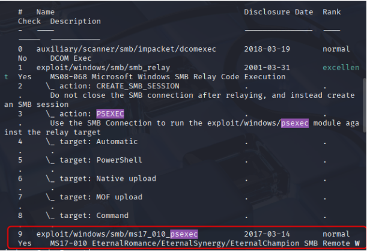
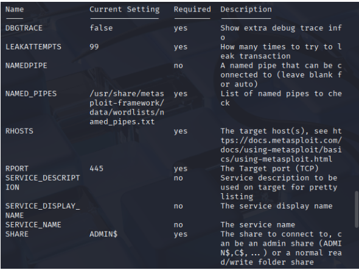
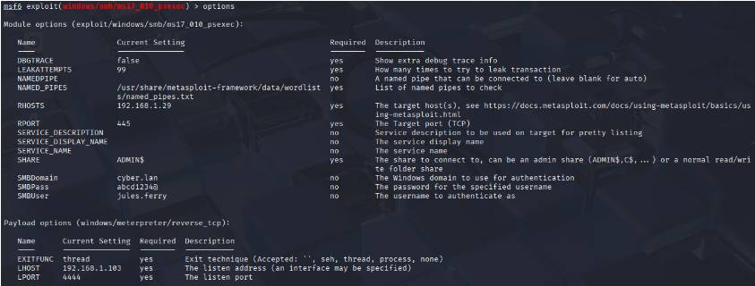
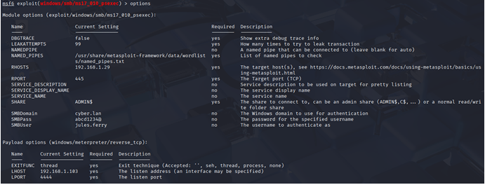
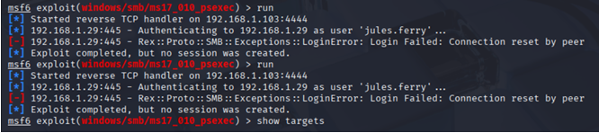
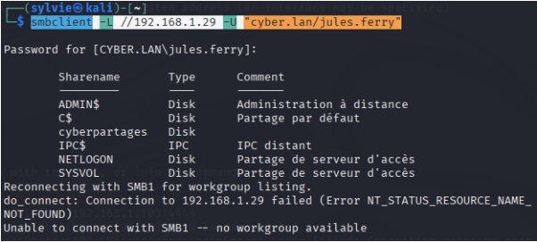
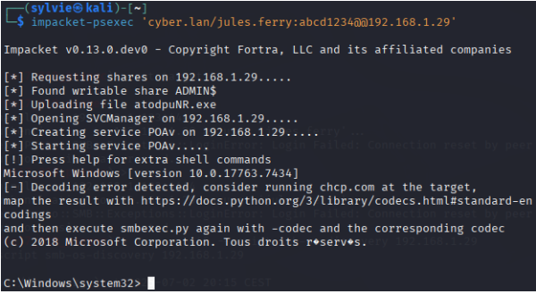
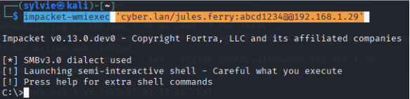

# X.3 Vérification post-correction et tests de non-régression

Après la mise en œuvre des mesures de durcissement (activation de la signature SMB, restriction/désactivation de NTLM, désactivation de LLMNR/NBT-NS et filtrage réseau), une phase de validation et de tests de non-régression a été réalisée pour confirmer que les vecteurs d’attaque exploités précédemment ne sont plus fonctionnels.

## X.3.1 Tests d’exploitation via Metasploit

**Objectif :**  
Vérifier que les modules d’exploitation type `psexec / SMB` ne permettent plus de compromettre les serveurs après durcissement.

**Procédure :**

```bash
msfconsole
search psexec
```

    





**Résultats :**
- Tous les modules sont disponibles, mais aucune tentative d’exploitation n’a abouti.”.
- L’accès aux partages administratifs est refusé.

**Interprétation :**

- La désactivation de NTLM et l’activation de la signature SMB bloquent les attaques de type Relay et empêchent l’exécution de code à distance non autorisée.

## X.3.2 Vérification manuelle avec smbclient

**Objectif :**  
Confirmer le comportement du service SMB après durcissement.

```bash
smbclient -L //192.168.1.29 -U "cyber.lan/jules.ferry"
```


**Résultats :**

- Les identifiants sont reconnus.
- L’accès aux partages administratifs reste refusé

**Conclusion :**

- Les protections SMB fonctionnent comme prévu et les vecteurs d’attaque précédemment exploités sont neutralisés.

## X.3.3 Validation de l’accès distant légitime (Impacket)

**Objectif :**  
Vérifier que les accès administratifs autorisés restent opérationnels après durcissement.

**Procédure :**
```bash
impacket-psexec 'cyber.lan/jules.ferry:abcd1234@@192.168.1.29'
```





**Résultats :**

- Authentification réussie.
- Accès distant possible uniquement avec :
    - Identifiants valides
    - Compte disposant de droits administratifs explicites
    - Authentification directe (non relayée)

**Interprétation :**

- Les attaques SMB/NTLM Relay sont bloquées.
- Les accès légitimes restent fonctionnels.
- Séparation claire entre usage autorisé et tentative d’exploitation.

## X.3.4 Conclusion de la phase de validation

Les tests post-correction confirment que :
- Les vecteurs d’attaque précédemment exploités (SMB Relay, NTLM Relay, Responder) sont neutralisés.
- Les outils d’administration distante restent utilisables dans un cadre sécurisé.
- Les mesures de durcissement sont efficaces, cohérentes et opérationnelles.

### Indicateurs de succès

Ces validations confirment l’efficacité des mesures de durcissement mises en œuvre dans les sections **X.2** (Mitigation SMB/NTLM) et **X.1** (Découverte réseau), garantissant une protection cohérente et intégrée de l’infrastructure.

| Test                    | Résultat attendu               | Résultat observé              | Statut  |
| ----------------------- | ------------------------------ | ----------------------------- | ------- |
| **Metasploit psexec**    | Échec exploitation             | Échec                         | ✅      |
| **smbclient partages**   | Accès refusé aux partages admin | Accès refusé                  | ✅      |
| **Impacket psexec**      | Accès autorisé avec identifiants valides | Réussi                | ✅      |

**Journalisation et détection proactive** :  
Même après durcissement, il est recommandé de journaliser et de corréler toutes les tentatives SMB et NTLM via un SIEM afin de détecter toute tentative de contournement ou activité suspecte. Cette approche permettra une détection rapide des attaques potentielles et fournira des données cruciales pour la réponse aux incidents en temps réel.

## X.3.5 Recommandations

- Forcer la signature SMB sur tous les serveurs et postes du domaine.
- Restreindre puis supprimer progressivement NTLM, après validation de la compatibilité applicative.
- Favoriser Kerberos comme protocole d’authentification unique.

> Ces mesures éliminent les vecteurs d’attaque identifiés lors de l’audit tout en maintenant l’accès administratif légitime.